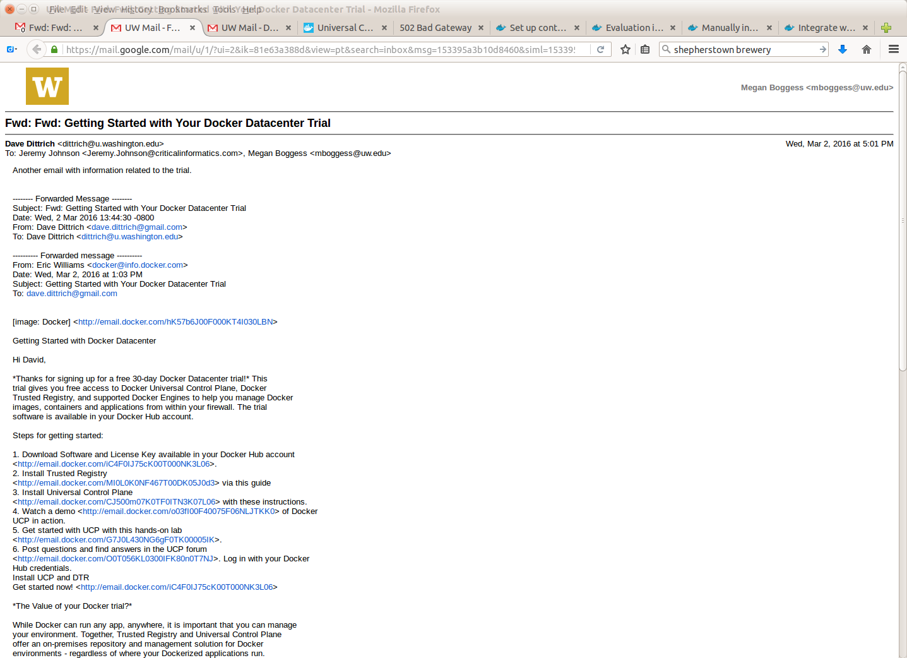
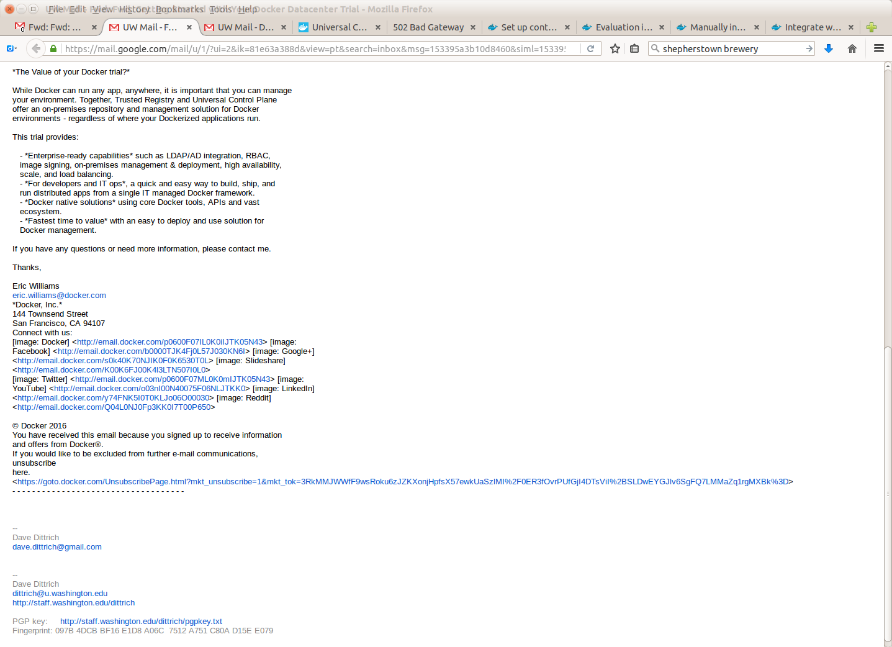
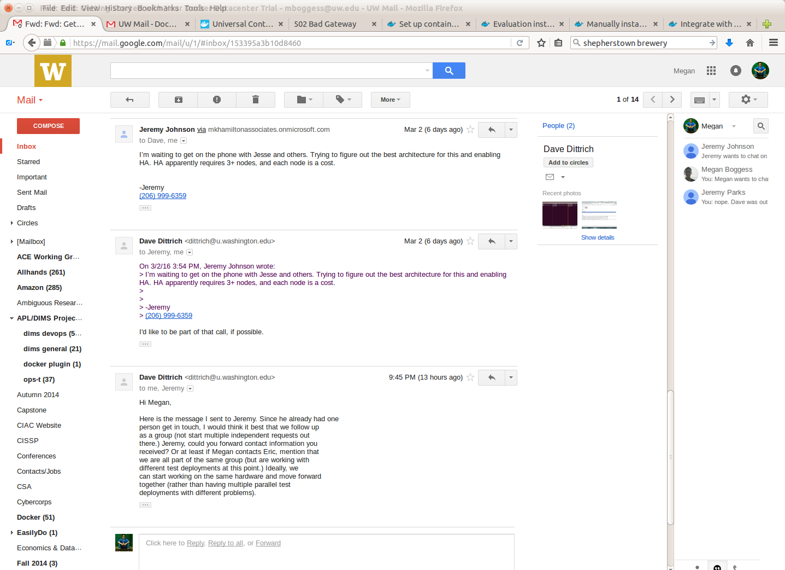

.. _dockerdatacenter:

Docker Datacenter
=================

This chapter documents email exchanges between DIMS team members
and Docker engineers about setting up and evaluating `Docker Datacenter`_.

.. _Docker Datacenter: https://www.docker.com/products/docker-datacenter

.. _initialinquiry:

Initial Inquiry
---------------

This section includes the pdf showing the basics of Docker Datacenter. 

.. image:: _images/GettingStarted4.png
  :target: _images/GettingStarted4.png 

:download:`pdf <../UW.DockerProposal3.2.16.pdf>`

This pdf was sent along with the response to our initial inquiry to 
Docker about evaluating Docker Datcenter on 3/2/16.

Jeremy also set up a call with other Docker engineers on 3/2/16.

.. _DTR:

Docker Trusted Repository Issues
--------------------------------

This section documents issues Megan was having when trying to set up a 
`Docker Trusted Registry`_ as part of a local Docker Datacenter.

.. image:: _images/DTRissues.png
  :target: _images/DTRissues.png

.. _Docker Trusted Registry: https://www.docker.com/products/docker-trusted-registry

.. _furtherinformation:

Further Information
-------------------

As more is learned about Docker Datacenter, particularly admin-related 
information, it will be documented here.

