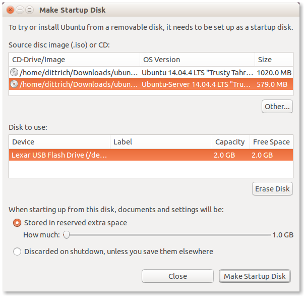

.. _installingbaremetal:

Installation of DIMS Components on "Bare-metal"
===============================================

This section describes installation of core Virtual Machine hypervisor servers,
developer workstations, or collector devices on **physical hardware**. Installation
of DIMS component systems in Virtual Machines is covered in Section
:ref:`installingvirtualmachines`.

The initial operating system installation is handled using operating system
installation media along with Kickstart auto-installation, followed by a
second-stage pre-configuration step, and lastly by installation of required
packages and configuration using Ansible.

A similar process is used to create Virtual Machines, though
using Packer instead of stock OS installation ISO media plus
Kickstart.  This is covered in the :ref:`dimspacker:lifecycle`
section of the :ref:`dimspacker:dimspacker` document.

Control and Target Prerequisites
--------------------------------

For the **control machine**, the following must be true:

    #. Must be able to run DIMS Ansible playbooks (i.e. be an existing developer
       workstation).

    #. Must have the latest ``dims-ci-utils`` installed. That is, the latest
       ``dims.remote.setupworkstation`` script should be in ``/opt/dims/bin``.

    #. Must have the required DIMS VPN enabled (so it can retrieve DIMS Git
       repos and artifacts on Jenkins requested by playbooks.)

    .. note::

	We are assuming the control machine is an existing workstation that has
	been successfully used to run DIMS playbooks and has at a minimum
	followed the original instructions for setting environment variables
	and installing ``dims-ci-utils``.

    ..

For the **target machine**, the following must be true:

    #. Base operating system installed.

    #. An ``ansible`` account must be present, configured for ``sudo``
       access for performing administrator tasks, with the matching public
       key allowing SSH access via the private key on the control machine.

    #. OpenVPN must be configured with a certificate allowing remote
       access to the internal DIMS network.

    #. Firewall rules must allow access from the control machine, or
       access must be available from the DIMS VPN.

.. _setupdevlaptop:

Setting up a DIMS Developer Laptop
----------------------------------

This section describes how to provision a new developer laptop using a custom
bootable USB installation drive.  Some of the steps are still manual ones, and
these instructions will be updated as a more script-driven process is created.
For now, this can serve to help guide the creation of the final process.

To acheive a repeatable and consistent process for installing a common base
operating system (in this case, Ubuntu 14.04 LTS) that is ready to immediately
be provisioned remotely from an Ansible control node, a customizable Ubuntu
installation USB drive is used with all of the files necessary to go from a
fresh computer system to a fully-functional networked host.

All of the steps for preparing an initial installation USB are given
below, in the order they need to be performed. Once completed, you
will have a bootable USB drive and a bit-copy of that drive that
can be re-used.

.. note::

    If you already have a bit-copy of one of these installation USB drives,
    skip to the :ref:`cloningdimsinstallusb` section.

    If you already have a fresh (uncustomized) installation USB disk, skip
    forward to the :ref:`customizingdimsinstallusb` section.

..

.. .. todo::
..
..     .. attention::
..
..        These instructions are work-in-progress notes following the email
..        thread started by Linda on 4/13/2015
..        ``Subject: [dims general] Documentation for provisioning new DIMS developers``.
..        Those, and other details, are found in Section :ref:`dimsciutils:appendices`
..        of :ref:`dimsciutils:dimsciutilities`.
..
..    ..
..
..    See also:
..
..    http://foswiki.prisem.washington.edu/Development/ProvisionNewUsers
..
..    :ref:`dimspacker:vmquickstart`
.. ..

.. note::

    The DIMS project purchased a number of Dell Precision M4800 laptops for
    use for development and demonstration purposes. These laptops require the
    use of proprietary drivers for the Broadcom Wireless NIC and NVIDIA
    graphics controller. The specific models can be identified using ``lspci``:

    .. code-block:: none

        $ lspci  | grep -i Broadcom
        03:00.0 Network controller: Broadcom Corporation BCM4352 802.11ac Wireless Network Adapter (rev 03)
        $ lspci | grep VGA
        01:00.0 VGA compatible controller: NVIDIA Corporation GK107GLM [Quadro K1100M] (rev a1)

    ..

    These drivers can be installed manually using the Ubuntu *Additional
    Drivers* app, and there is prototype code in the Ubuntu post-install script
    designed to automate this task.

    .. _additionaldrivers:

    .. figure:: images/additional-drivers.png
       :width: 85%
       :align: center

       Additional Drivers from working laptop

..

.. _prepareinstallusb:

Preparation of Ubuntu installation USB drive
~~~~~~~~~~~~~~~~~~~~~~~~~~~~~~~~~~~~~~~~~~~~

This section describes the manual steps used to create a two-partition
8GB Ubuntu installation USB drive. The following section describes
the use of the program ``dims.install.createusb`` to bit-image copy
this drive, store it for shared use by DIMS team members, and
use this image copy to clone the original USB drive and then
populate it with custom information to be used when auto-installing
Ubuntu 14.04 on a development laptop using this customized USB
drive.

.. note::

    Start out by studying the ``--help`` output of ``dims.install.createusb``
    to understand the defaults it uses (shown by the highlighted lines in the
    following code block). These defaults are hard-coded into the program
    and should be updated when new Ubuntu install ISO images are used.
    Some of the command examples below make use of these defaults (rather
    than explicitly including all options on the command line.)

    .. code-block:: none
       :emphasize-lines: 9,11,13,15,17,20,34,35,40

        Usage: dims.install.createusb [options] [args]

        Use "dims.install.createusb --help" to see help on command line options.

        Options:
          -h, --help            show this help message and exit
          -d, --debug           Enable debugging.
          -D DEVICE, --device=DEVICE
                                Device file for mounting USB. [default: sdb]
          -H HOSTNAME, --hostname=HOSTNAME
                                Hostname of system to install. [default dimsdev3]
          -l USBLABEL, --usblabel=USBLABEL
                                USB device label. [default: DIMSINSTALL]
          --ubuntu-base=UBUNTUBASE
                                Ubuntu base version. [default: 14.04]
          --ubuntu-minor=UBUNTUMINOR
                                Ubuntu minor version. [default: 4]
          --base-configs-dir=BASE_CONFIGS_DIR
                                Base directory for configuration files. [default:
                                /opt/dims/nas/scd]
          -u, --usage           Print usage information.
          -v, --verbose         Be verbose (on stdout) about what is happening.

          Development Options:
            Caution: use these options at your own risk.

            --find-device       Attempt to find USB device actively mounted and exit.
            --empty-casper      Empty out all contents (except lost+found) from
                                casper-rw and exit.
            --ls-casper         Just list contents of casper-rw file system.
            --label-casper      Put --usblabel into casper-rw and exit.
            --mount-casper      Mount casper-rw in cwd and exit.
            --umount-casper     Unmount casper-rw and exit.
            --mount-usb         Mount DIMS install USB and exit. [default: sdb]
            --unmount-usb       Unmount DIMS install USB and exit. [default: sdb]
            --read-usb-into     Read USB drive into file. [default: False]
            --write-usb-from    Write USB drive from file. [default: False]
            -f IMAGEFILE, --imagefile=IMAGEFILE
                                File name to use for storing compressed USB image.
                                [default: ubuntu-14.04.4-install.dd.bz2]
            --block-size=BLOCK_SIZE
                                Block size to use for 'dd' read/write. [default: 512]

    ..

..

Partition USB drive
^^^^^^^^^^^^^^^^^^^

If you are starting out with a blank USB drive, you must first partition the
drive and label it so it is recognizable by DIMS scripts.  An easy program to
use for this purpose on Ubuntu is the `Gnome Partition Editor`_ (a.k.a.,
**GParted**).

Figure :ref:`gparted` shows an 8GB USB drive partitioned using GParted.  Create
two partitions with the primary partition (shown here as ``/dev/sdb1``) marked
as **bootable**, with a ``FAT32`` file system, and labeled ``DIMSINSTALL``.
Make the second partition an ``ext3`` file system and label it ``DIMSBACKUP``.

.. _Gnome Partition Editor: http://gparted.org/

.. _gparted:

.. figure:: images/GParted.png
   :width: 85%
   :align: center

   GParted formatting and labeling

..

The paritions can also be shown using ``fdisk -l`` (here assuming the disk
is mounted as ``/dev/sdb``).

.. code-block:: none

    [dittrich@dimsdev2 git]$ sudo fdisk -l /dev/sdb

    Disk /dev/sdb: 8009 MB, 8009023488 bytes
    247 heads, 62 sectors/track, 1021 cylinders, total 15642624 sectors
    Units = sectors of 1 * 512 = 512 bytes
    Sector size (logical/physical): 512 bytes / 512 bytes
    I/O size (minimum/optimal): 512 bytes / 512 bytes
    Disk identifier: 0x000cc03e

       Device Boot      Start         End      Blocks   Id  System
    /dev/sdb1   *        2048     4196351     2097152    b  W95 FAT32
    /dev/sdb2         4196352    15640575     5722112   83  Linux

..

.. note::

   The ``dims.install.createusb`` script looks for a partition with the
   label ``DIMSINSTALL`` and will not manipulate drives that do not
   contain a partition with this label.

..

.. note::

    The second partition can be used for backing up a user's directory
    contents prior to re-installation of the operating system on a system.
    Since the kickstart process automatically partitions the hard drive,
    existing contents would be lost.

    .. TODO(dittrich): Develop backup script to facilitate re-installation/upgrading OS.
    .. todo::

        A program to perform these backups has yet to be developed and tested.

    ..

..

Create Ubuntu installation USB
^^^^^^^^^^^^^^^^^^^^^^^^^^^^^^

Installation of Ubuntu on a developer system is performed using the *Server*
installation image (e.g., ``ubuntu-14.04.4-server-amd64.iso``).

The program
to use for this purpose is the Ubuntu **Startup Disk Creator**. Run it
with ``root`` privileges (as they are needed to write the Master Boot
Record on the USB drive).

.. code-block:: none

    $ sudo usb-creator-gtk &

..

After
downloading the Ubuntu Server installation ISO and verifying its integrity
using the signed SHA256 hash files, write the installation ISO to the
partitioned USB.

The primary partition (i.e., ``/dev/sdb1``) is where the
Ubuntu installation ISO image (and ``casper-rw`` file system storage file,
where DIMS customization files will be stored) will be written.  Make sure
that the option is checked to store files across boots, which will create
a ``casper-rw`` partition image within the startup disk image.

.. note::

    The second partition does not show up because it is not marked as bootable,
    though it may be mounted and visible using the File viewer.

..

Figure :ref:`makestartup` shows what the `Ubuntu Startup Disk Creator`_ GTK
application will look like at this step.

.. _Ubuntu Startup Disk Creator: https://apps.ubuntu.com/cat/applications/precise/usb-creator-gtk/

.. _makestartup:

   Ubuntu Make Startup Disk

..

.. note::

    If you have to re-create the ``DIMSINSTALL`` partition with the
    Startup Disk Creator, it will erase the entire partition (which
    removes the label). To manually change the label, use GNU's GParted
    Partition Editor as described in the Ubuntu `RenameUSBDrive`_ page.

    First verify the device name (so you don't accidentally harm another
    auto-mounted device), then use ``mlabel`` as seen here:

    .. code-block:: none
       :emphasize-lines: 3

        $ mount | grep '^/dev/sd'
        /dev/sda1 on /boot type ext3 (rw)
        /dev/sdb1 on /media/dittrich/917D-FA28 type vfat (rw,nosuid,nodev,uid=1004,gid=1004,shortname=mixed,dmask=0077,utf8=1,showexec,flush,uhelper=udisks2)
        /dev/sdb2 on /media/dittrich/DIMSBACKUP type ext3 (rw,nosuid,nodev,uhelper=udisks2)
        $ sudo mlabel -i /dev/sdb1 ::DIMSINSTALL

    ..

    Now unmount and re-mount the device, and verify that the label did in
    fact get changed.

    .. code-block:: none
       :emphasize-lines: 3

        $ dims.install.createusb --unmount-usb
        $ dims.install.createusb --mount-usb
        $ mount | grep '^/dev/sd'
        /dev/sda1 on /boot type ext3 (rw)
        /dev/sdb1 on /media/dittrich/DIMSINSTALL type vfat (rw,nosuid,nodev,uid=1004,gid=1004,shortname=mixed,dmask=0077,utf8=1,showexec,flush,uhelper=udisks2)
        /dev/sdb2 on /media/dittrich/DIMSBACKUP type ext3 (rw,nosuid,nodev,uhelper=udisks2)

    ..

    .. todo::

        Add this feature to make this easier.

    ..

..

.. _RenameUSBDrive: https://help.ubuntu.com/community/RenameUSBDrive

Bit-copy installation USB for cloning
^^^^^^^^^^^^^^^^^^^^^^^^^^^^^^^^^^^^^

After creating a bootable Ubuntu installation USB (which has not yet been
customized for a specific host installation), a copy of the boot disk should be
made. This allows for the vanilla installation USB to be cloned to as many USB
drives as are needed, each then being uniquely customized. This customization
includes host name, SSH keys, SSH ``authorized_keys`` and ``known_hosts``
files, OpenVPN certificates, and any other files used in the installation and
setup process necessary to result in a remotely Ansible configurable host.

.. code-block:: none

    $ dims.install.createusb --verbose --read-usb-into
    [+++] dims.install.createusb
    [+++] Reading USB drive on sdb into ubuntu-14.04.4-install.dd.bz2
    15642624+0 records in
    15642624+0 records out
    8009023488 bytes (8.0 GB) copied, 1171.45 s, 6.8 MB/s
    2498225+1 records in
    2498225+1 records out
    1279091271 bytes (1.3 GB) copied, 1171.51 s, 1.1 MB/s
    [+++] Finished writing ubuntu-14.04.4-install.dd.bz2 in 0:19:31.506338 seconds
    $ ls -l *.bz2
    -rw-r--r-- 1 dittrich dittrich  837948365 Jan 18 18:57 ubuntu-14.04.2-install.dd.bz2
    -rw-rw-r-- 1 dittrich dittrich 1279091271 Mar 25 21:49 ubuntu-14.04.4-install.dd.bz2

..

.. _cloningdimsinstallusb:

Cloning an installation USB
~~~~~~~~~~~~~~~~~~~~~~~~~~~

The previous section walked through the process of creating a
skeleton Ubuntu auto-installation USB drive and bit-copying it
to a compressed image file.  This section describes how to take
that compressed bit-copy and clone it to USB drives that are
then customized for installing Ubuntu on specific bare-metal
hosts for subsequent Ansible configuration.

We will assume that the previous steps were followed, producing
a clone of the Ubuntu 14.04.4 install ISO in a file named
``ubuntu-14.04.4-install.dd.bz2``, and that the USB drive we
will be cloning to is available as ``/dev/sdb``.

.. caution::

    Be sure that you confirm this is correct, since this script
    does direct writes using ``dd``, which can destroy the file
    system if applied to the wrong drive! There was not enough time
    to make this script more robust against use by someone who
    is unfamilar with bit copy operations in Unix/Linux.

..

.. code-block:: none

    $ dims.install.createusb --write-usb-from --verbose
    [+++] dims.install.createusb
    [+++] Partition /dev/sdb12 is not mounted
    [+++] Partition /dev/sdb11 is not mounted
    [+++] Writing ubuntu-14.04.4-install.dd.bz2 to USB drive on sdb
    dd: error writing ‘/dev/sdb’: No space left on device
    15632385+0 records in
    15632384+0 records out
    8003780608 bytes (8.0 GB) copied, 2511.1 s, 3.2 MB/s

    bzip2: I/O or other error, bailing out.  Possible reason follows.
    bzip2: Broken pipe
            Input file = ubuntu-14.04.4-install.dd.bz2, output file = (stdout)
    [+++] Wrote sdb to USB drive on ubuntu-14.04.4-install.dd.bz2 in 0:41:51.110440 seconds

..

.. note::

   The ``dd`` error "No space left on device" and the ``bzip2``
   error "Broken pipe" are normal. This happens because the exact
   number of blocks read from the disk in the copy operation precisely
   matches the number of blocks coming from the compressed file,
   which triggers a "disk full" condition. A direct read/write operation
   on the device, rather than shelling out to ``dd``, would be more
   robust (but would also consume more time in coding that was not
   available.)

..

.. _customizingdimsinstallusb:

Customzing an installation USB
~~~~~~~~~~~~~~~~~~~~~~~~~~~~~~

The installation ISO is customized with SSH keys, OpenVPN certificates, etc.,
by inserting files from a common file share into the installation USB.

.. TODO(dittrich): Deal with encryption of the installation USB's contents
.. danger::

    These files that are inserted into the USB are **not** encrypted, and
    **neither are** the installation USB's file systems. This requires physical
    control of the USB disk. These files should either be encrypted with
    something like Ansible Vault, or the file system encrypted such that it is
    decrypted as part of the Ubuntu install process.

..

In order to make the necessary files available to any of the DIMS developers,
an NFS file share is used. Alternatives remote file sharing protocols include
SSHFS and SMB.

An environment variable ``CFG`` points to the path to the files used to
customize the installation ISO. At present, these are in directories with
the short name of the host to be installed (e.g., ``dimsdev3``).

.. code-block:: none

    [dimsenv] dittrich@dimsdev3:/opt/dims/nas () $ echo $CFG
    /opt/dims/nas/scd
    [dimsenv] dittrich@dimsdev3:/opt/dims/nas () $ tree $CFG/dimsdev3
    /opt/dims/nas/scd/dimsdev3
    ├── IP
    ├── openvpn-cert
    │   ├── 01_uwapl_dimsdev3.conf
    │   └── 02_prsm_dimsdev3.conf
    ├── PRIVKEY
    ├── REMOTEUSER
    ├── ssh-host-keys
    │   ├── key_fingerprints.txt
    │   ├── known_hosts.add
    │   ├── ssh_host_dsa_key
    │   ├── ssh_host_dsa_key.pub
    │   ├── ssh_host_ecdsa_key
    │   ├── ssh_host_ecdsa_key.pub
    │   ├── ssh_host_ed25519_key
    │   ├── ssh_host_ed25519_key.pub
    │   ├── ssh_host_rsa_key
    │   └── ssh_host_rsa_key.pub
    └── ssh-user-keys
        ├── ubuntu_install_rsa
        └── ubuntu_install_rsa.pub

    3 directories, 17 files

..

.. note::

    The OpenVPN certificates are created by hand. Two separate VPNs were originally
    used as hardware was split between two separate server rooms on two separate
    subnets, each with non-routable (RFC 1918) VLANs behind the VPNs. Hardware was
    moved into one data center and this will be reduced to one VPN as soon as
    VM consolidation and cabling changes can be made to use a single VLAN.

..

.. note::

    The ``IP``, ``PRIVKEY``, and ``REMOTEUSER`` files hold the values used by
    some DIMS scripts for setting variables used for remotely provisioning the
    host using Ansible. We are migrating to using ``group_vars`` and/or
    ``host_vars`` files for holding these values so they can be shared by
    other scripts and used in Jinja templates.

..

New SSH host key sets can be generated using ``keys.host.create``.

.. code-block:: none

    [dimsenv] dittrich@dimsdemo1:/opt/dims/nas () $ keys.host.create -d $CFG/dimsdev3/ssh-host-keys/ -v -p dimsdev3
    [+++] Storing files in /opt/dims/nas/scd/dimsdev3/ssh-host-keys/
    [+++] Removing any previous keys and related files
    [+++] Generating 1024 bit dimsdev3 ssh DSA key
    [+++] Generating 2048 bit dimsdev3 ssh RSA key
    [+++] Generating 521 bit dimsdev3 ssh ECDSA key
    [+++] Generating 1024 bit dimsdev3 ssh ED25519 key
    [+++] Key fingerprints
    1024 70:0e:ee:8b:23:34:cf:34:aa:3b:a0:ca:fd:50:58:a9  'dimsdev3 ssh DSA host key' (DSA)
    2048 7f:89:da:e7:4d:92:fd:c1:3f:96:4f:05:f5:72:63:65  'dimsdev3 ssh RSA host key' (RSA)
    521 0a:af:c7:c4:a8:35:47:48:22:b3:7e:5b:bf:39:76:69  'dimsdev3 ssh ECDSA host key' (ECDSA)
    256 b2:dd:be:36:4d:03:a4:57:17:fb:a9:a9:97:e5:58:51  'dimsdev3 ssh ED25519 host key' (ED25519)
    [dimsenv] dittrich@dimsdemo1:/opt/dims/nas () $ ls -l $CFG/dimsdev3/ssh-host-keys
    total 18
    -rw-rw-r-- 1 nobody nogroup  362 Apr  4 11:24 key_fingerprints.txt
    -rw-rw-r-- 1 nobody nogroup 1304 Apr  4 11:24 known_hosts.add
    -rw------- 1 nobody nogroup  668 Apr  4 11:24 ssh_host_dsa_key
    -rw-r--r-- 1 nobody nogroup  617 Apr  4 11:24 ssh_host_dsa_key.pub
    -rw------- 1 nobody nogroup  361 Apr  4 11:24 ssh_host_ecdsa_key
    -rw-r--r-- 1 nobody nogroup  283 Apr  4 11:24 ssh_host_ecdsa_key.pub
    -rw------- 1 nobody nogroup  432 Apr  4 11:24 ssh_host_ed25519_key
    -rw-r--r-- 1 nobody nogroup  113 Apr  4 11:24 ssh_host_ed25519_key.pub
    -rw------- 1 nobody nogroup 1679 Apr  4 11:24 ssh_host_rsa_key
    -rw-r--r-- 1 nobody nogroup  409 Apr  4 11:24 ssh_host_rsa_key.pub

..

The equivalent script to generate SSH user keys has not yet been written,
but an early helper ``Makefile`` is available to perform these steps
in a consistent manner. The highest level of security is acheived by
having unique SSH keys for each account, however this would significantly
complicate use of Ansible, which is designed to control a large number
of hosts in a single run.  Each DIMS instance being controlled by Ansible
will thus have a shared key for the Ansible account that, at most, is
unique to a deployment and/or category.

.. code-block:: none

..

.. TODO(dittrich): Stopped here - finish these instructions
.. todo::

    Stopped here. Finish these instructions...

    * Force the IP address for the initial ``dims.ansible-playbooks`` run.
      (Add an ``--ip-address`` option to keep from forcing user to write to
      the ``inventory/inventory`` file just to make the initial connection.)

    * Set up the user account. (Add a task playbook to do this, installing
      user account, SSH key, and creating initial Python virtualenv clone
      in user's account.)

..
