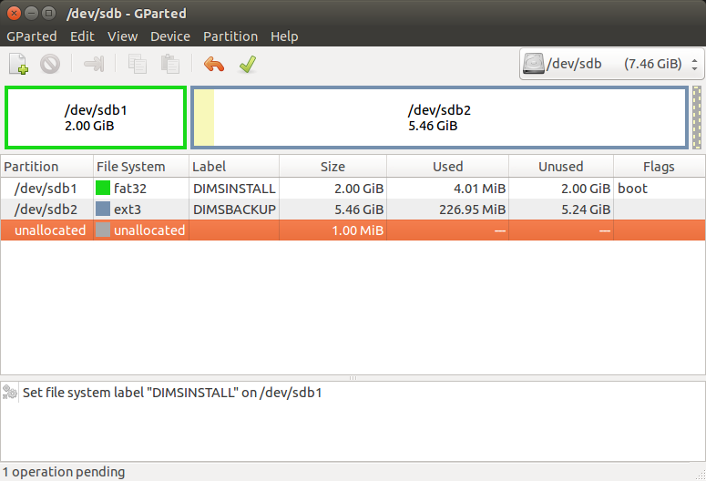

.. _installingbaremetal:

Installation of "Bare-metal" Workstations and Collectors
========================================================

This section describes installation of core Virtual Machine
hypervisor servers, developer workstations, or collector
devices on physical hardware. The initial operating system
installation is handled using operating system installation
media along with Kickstart auto-installation, followed by
a second-stage pre-configuration step, and lastly by
installation of required packages and configuration using
Ansible.

A similar process is used to create Virtual Machines, though
using Packer instead of stock OS installation ISO media plus
Kickstart.  This is covered in the :ref:`dimspacker:lifecycle`
section of the :ref:`dimspacker:dimspacker` document.

.. _setupdevlaptop:

Setting up a DIMS Developer Laptop
----------------------------------

.. todo::

    .. attention::

       These instructions are work-in-progress notes following the email
       thread started by Linda on 4/13/2015
       ``Subject: [dims general] Documentation for provisioning new DIMS developers``.
       Those, and other details, are found in Section :ref:`dimsciutils:appendices`
       of :ref:`dimsciutils:dimsciutilities`.
    
       The emails were cut/pasted here and are being turned into instructions
       that can be followed to perform an install.

   ..

   See also:

   http://foswiki.prisem.washington.edu/Development/ProvisionNewUsers

   :ref:`dimspacker:vmquickstart`

   Maybe we can delete the following notes..

   .. note:: 

      Our ansible playbooks have been updated so more tools are installed into
      the ``dimsenv`` virtual environment: ``git``, ``git-extras`` from our
      GitHub repo, as well as ``hubflow`` and ``mr``.  Therefore we now have
      playbooks that can fully provision a new developer workstation, except for:

          #. Initial ansible public key so Jenkins job can run Ansible against
             the new workstation
          #. User passwords
          #. User private keys to users' ``$HOME/.ssh`` directories
          #. Set up VPN

  ..

  .. note::

     The ansible public key on Jenkins has been copied to ``dims-keys`` repo so it can be more easily
     obtained. It is located in ``dims-keys.git/ansible-pub/id_dsa.pub``, ``master`` or ``develop`` branch.

  ..

..

The following describes how to provision a new developer laptop. Some of the steps are
still manual ones, and these instructions will be updated as a more script-driven process
is created. For now, this can serve to help guide the creation of the final process.

Definitions
~~~~~~~~~~~

*Control*
    Machine that runs the Ansible plays

*Target*
    Machine that is being provisioned

Variables
~~~~~~~~~

The following variables are referenced in these directions:

    * ``$REMOTEUSER`` - User account on target that will be connected to by control
      via SSH.

    * ``$PRIVKEY`` - Full path on control to temporary SSH private key for provisioning

    * ``$PUBKEY`` - Full path on control to temporary SSH public key for provisioning

    * ``$IP`` - IP of target (needs to be reachable by control)

Control Machine Prerequisites
~~~~~~~~~~~~~~~~~~~~~~~~~~~~~

For the **control machine**, the following must be true:

    #. Must be able to run DIMS ansible playbooks (i.e. be an existing developer 
       workstation). 

    #. Has the latest dims-ci-utils installed. That is, the latest 
       ``dims.remote.setupworkstation``
       script should be in ``/opt/dims/bin``.

    #. Has the DIMS VPN enabled (so it can retrieve DIMS git repos and artifacts on 
       Jenkins requested by playbooks)

We are assuming the control machine is an existing workstation that has been
successfully used to run DIMS playbooks and has at a minimum followed the original
instructions for setting environment variables and installing ``dims-ci-utils``.

.. _prepareinstallusb:

Preparation of Ubuntu installation USB drive
~~~~~~~~~~~~~~~~~~~~~~~~~~~~~~~~~~~~~~~~~~~~

This section describes the manual steps used to create a two-partition
8GB Ubuntu installation USB drive. The following section describes
the use of the program ``dims.install.createusb`` to bit-image copy
this drive, store it for shared use by DIMS team members, and
use this image copy to clone the original USB drive and then
populate it with custom information to be used when auto-installing
Ubuntu 14.04 on a development laptop using this customized USB
drive.

.. note::

    This same USB drive image has a second partition that can be used for
    backing up a user's directory contents prior to re-installation
    of the DIMS development tools. This backup script has yet to be
    developed and tested.

..

   GParted formatting and labeling

..

.. figure:: images/Make_Startup_Disk.png
   :width: 85%
   :align: center

   Ubuntu Make Startup Disk

..

.. code-block:: none

    [dittrich@dimsdev2 git]$ sudo fdisk -l /dev/sdb

    Disk /dev/sdb: 8009 MB, 8009023488 bytes
    247 heads, 62 sectors/track, 1021 cylinders, total 15642624 sectors
    Units = sectors of 1 * 512 = 512 bytes
    Sector size (logical/physical): 512 bytes / 512 bytes
    I/O size (minimum/optimal): 512 bytes / 512 bytes
    Disk identifier: 0x000cc03e

       Device Boot      Start         End      Blocks   Id  System
    /dev/sdb1   *        2048     4196351     2097152    b  W95 FAT32
    /dev/sdb2         4196352    15640575     5722112   83  Linux

..

#. Download copy of DIMS Ubuntu 14.04 compressed install USB drive image.

#. Use the Ubuntu **Startup Disk Creator** to write the Ubuntu Desktop
   amd64 install ISO image to the ``DIMSINSTALL`` partition on the
   USB drive.

.. note::

    If you have to re-create the ``DIMSINSTALL`` partition with the
    Startup Disk Creator, it will erase the entire partition (which
    removes the label). To manually change the label, use GNU's GParted
    Partition Editor as described in the Ubuntu `RenameUSBDrive`_ page.

..

.. _RenameUSBDrive: https://help.ubuntu.com/community/RenameUSBDrive

.. TODO(dittrich): Stopped here - finish these instructions
.. todo::

    Stopped here. Finish these instructions...

..

.. _cloningdimsinstallusb:

Cloning and customization of DIMS Ubuntu 14.04 installation USB
"""""""""""""""""""""""""""""""""""""""""""""""""""""""""""""""

This section describes the command line method for cloning a skeleton
Ubuntu 14.04 custom auto-installation USB drive, and customizing it with
specific data for that particular host, including SSH host keys, an OpenVPN
certificate, and other data necessary for the automatic installation of
Ubuntu 14.04.  After installation, a second step of installing DIMS
pre-requisite tools, accounts, and settings must be performed using
the script ``dims.ansible-playbook`` from a *Control* host. This
will be described in the following sections.

.. _targetprerequisites:

Target Machine Prerequisites
~~~~~~~~~~~~~~~~~~~~~~~~~~~~

The **target machine** should have Ubuntu 14.04.2 LTS installed. The initial user account
name should be recorded and is referred to in these directions as ``$REMOTEUSER``, since
the control machine will connect to the target as this user.

For the **target machine**, the following must be true:

   #. Must have OpenSSH server installed.

       .. code-block:: bash

           $ sudo apt-get install openssh-server

       ..

   #. Must have firewall open for access to 22/tcp.

       .. code-block:: bash

           $ sudo iptables -nvL

       ..

   #. Must have OpenVPN installed and configured with certificate to allow access to
      artifact repository.

       .. code-block:: bash

           $ sudo apt install openvpn

       ..

       .. todo::

           The artifacts are being moved to ``https://depts.washington.edu/dimsdoc/artifacts/``
           to allow access without needing a VPN connection.

       ..

Steps
~~~~~

On the control machine:
    
    #. Create a temporary SSH key-pair for the control to use to connect via
       SSH to the target. Private key path on control is ``$PRIVKEY`` 
       and public key path is ``$PUBKEY``.

       For example:

       .. code-block:: none

            $ ssh-keygen -t rsa -C "Temporary provisioning key" -f provisioning_key_rsa
            Generating public/private rsa key pair.
            Enter passphrase (empty for no passphrase): 
            Enter same passphrase again: 
            Your identification has been saved in provisioning_key_rsa.
            Your public key has been saved in provisioning_key_rsa.pub.
            The key fingerprint is:
            46:66:13:82:f0:85:07:ef:10:6e:ab:1c:f0:f6:8f:9b Temporary provisioning key
            The key's randomart image is:
            +--[ RSA 2048]----+
            |  ..o+o .        |
            |   oo+.. .       |
            |.   =.. =        |
            | o . + + .       |
            |  + . . S        |
            | o +   .         |
            |  o .            |
            |     +           |
            |    E..          |
            +-----------------+

       ..

On the target machine:

    #. For initial install, must have a wired ethernet connection.
       Preferably, one that is accessible from the internet (for Ansible
       configuration step).

    #. Install OS from USB thumb drive. (Second phase of install is done by
       remotely downloaded script.)

    #. From a control system, run the ``dims.ansible-playbooks`` script with the
       name of the laptop.  This may have to be done by someone else who has a
       fully-configured DIMS system to act as the Ansible control host.

    #. Log into the ``ansible`` account using the password generated for your
       laptop. (Keep this password secure.)

    #. Create a password for your personal account.

    #. Copy your DIMS private SSH key into the ``~/.ssh/`` directory. This is
       required for access to Git repositories.

       .. todo::

          [FIX: copy required Git repos to USB drive, then install them in
          the ansible account, so they are available for use for local
          configuration.]

       ..

    #. Open a Terminal window. You should see something like the following:

       .. code-block:: none

           [+++] DIMS shell initialization
           [+++] Sourcing /opt/dims/etc/bashrc.dims.d/bashrc.dims.virtualenv ...
           [+++] Activating DIMS virtual environment (dimsenv) [ansible-playbooks v1.2.63]
           [+++] (Create file /Users/dittrich/.DIMS_NO_DIMSENV_ACTIVATE to disable)
           [+++] Virtual environment 'dimsenv' activated [ansible-playbooks v1.2.63]

       ..

    #. Run the command ``dims.git.syncrepos`` to download the full set of Git
       source repositories for the DIMS project.  Use this same command on a
       regular basis to keep Git repositories up to date (especially before
       starting to make code changes that you want to push, as it decreases
       the chance you will have a conflict that requires manually merging.)

    #. Manualy load the Broadcom WiFi interface driver using "Additional Drivers"
       on the Dell laptops purchased for DIMS development.

On the control machine:

    #. Run the script ``dims.remote.setupworkstation``:

       .. code-block:: bash

           $ REMOTEUSER=$REMOTEUSER IP=$IP PRIVKEY=$PRIVKEY dims.remote.setupworkstation

       ..

       Alternatively, as long as ``REMOTEUSER``, ``IP``, and ``PRIVKEY`` variables
       have already been set and exported (in a controlling script, for
       example), you can just run:

       .. code-block:: bash

           $ dims.remote.setupworkstation

       ..

       See the test section :ref:`testonvm` for an example

At this point all provisioning we can currently do via Ansible playbooks is done.
Steps in the process need to be added for the following:

     #. Putting DIMS user(s) private key(s) on the target machine. 

        .. note::

            Private keys
            are not currently controlled. The private key is generated via a script
            in the ``dims-keys.git`` repo, the corresponding public key is pushed to the 
            remote repo, and the private key is manually transferred to the new user via some
            secure method. See :ref:`ansibleplaybooks:publickeys` to see the
            current method of creating/updating/maintaining DIMS user SSH key pairs.

        ..

     #. Provisioning new machine so it can access the VPN (needs VPN cert)

.. _testonvm:

Test dims.remote.setupworkstation script
~~~~~~~~~~~~~~~~~~~~~~~~~~~~~~~~~~~~~~~~

The steps above were run manually on a vagrant VM in order to test the
``dims.remote.setupworkstation`` script. The following describes how this testing was
performed.

First, the tester activated the ``dimsenv`` virtual environment:

.. code-block:: bash

    $ workon dimsenv

.. 

A desktop VM had previously been created by the tester following the instructions 
in :ref:`dimspacker:vmquickstart`. The tester had named the VM ``dimsdesktop``, so that is how
it is referenced here. 

The tester navigated to the VM's home directory (i.e., the
directory containing the VM's Vagrantfile) and destroyed the existing VM in order
to start from scratch:

.. code-block:: bash

    $ cd $GIT/dims-vagrant/ubuntu-14.04.2-amd64/dimsdesktop
    $ vagrant destroy

..

The tester used the ``nic2`` script to add a private IP address to the
``Vagrantfile`` for this VM:

.. code-block:: bash

    $ ../nic2 192.168.56.87

..

(This could also have been accomplished by editing the ``Vagrantfile``)

Next the tester created the temporary SSH key pair:

.. code-block:: none

    $ ssh-keygen -t rsa -C "Temporary provisioning key" -f provisioning_key_rsa
    Generating public/private rsa key pair.
    Enter passphrase (empty for no passphrase): 
    Enter same passphrase again: 
    Your identification has been saved in provisioning_key_rsa.
    Your public key has been saved in provisioning_key_rsa.pub.
    The key fingerprint is:
    46:66:13:82:f0:85:07:ef:10:6e:ab:1c:f0:f6:8f:9b Temporary provisioning key
    The key's randomart image is:
    +--[ RSA 2048]----+
    |  ..o+o .        |
    |   oo+.. .       |
    |.   =.. =        |
    | o . + + .       |
    |  + . . S        |
    | o +   .         |
    |  o .            |
    |     +           |
    |    E..          |
    +-----------------+

..

At this point, the tester has values for all the variables needed to run the script:

    #. ``$IP`` is the IP added to the ``Vagrantfile`` (192.168.56.87)
    #. ``$REMOTEUSER`` is ``$USER`` - the process by which the VM was created sets the
       initial user of the VM to ``$USER``
    #. ``$PRIVKEY`` = ``$GIT/dims-vagrant/ubuntu-14.04.2-amd64/dimsdesktop/provisioning_key_rsa``

Next, the tester transferred the public key (``$PUBKEY``) contents to the VM.
This was accomplished by adding provisioners to the ``Vagrantfile``.  These
will run the first time ``vagrant up`` is executed or when ``vagrant
provision`` is executed. (There are other ways this could have been done if the
tester is not familiar with Vagrant provisioning).

The following lines were added to the ``Vagrantfile`` before the last ``end``
statement. You would substitute your user's home folder for the tester's (e.g.,
``/home/lcolby``):

.. code-block:: ruby

    config.vm.provision :file, :source => "provisioning_key_rsa.pub", :destination => "/home/lcolby/provisioning_key_rsa.pub"
    config.vm.provision :shell, :inline => "cat /home/lcolby/provisioning_key_rsa.pub >> /home/lcolby/.ssh/authorized_keys"
    config.vm.provision :shell, :inline => "rm /home/lcolby/provisioning_key_rsa.pub"

.. 

The VM was instantiated:

.. code-block:: none

    $ vagrant up
    Bringing machine 'default' up with 'virtualbox' provider...
    ==> default: Importing base box 'ubuntu-14.04.2-amd64-desktop-keyed'...
    ==> default: Matching MAC address for NAT networking...
    ==> default: Setting the name of the VM: dimsdesktop_default_1435249279321_66288
    ==> default: Clearing any previously set network interfaces...
    ==> default: Preparing network interfaces based on configuration...
        default: Adapter 1: nat
        default: Adapter 2: hostonly
    ==> default: Forwarding ports...
        default: 22 => 2222 (adapter 1)
    ==> default: Running 'pre-boot' VM customizations...
    ==> default: Booting VM...
    ==> default: Waiting for machine to boot. This may take a few minutes...
        default: SSH address: 127.0.0.1:2222
        default: SSH username: lcolby
        default: SSH auth method: private key
        default: Warning: Connection timeout. Retrying...
        default: Warning: Remote connection disconnect. Retrying...
    ==> default: Machine booted and ready!
    ==> default: Checking for guest additions in VM...
    ==> default: Configuring and enabling network interfaces...
    ==> default: Mounting shared folders...
        default: /vagrant => /Users/lcolby/git-new/vagrant-run/ubuntu-14.04.2-amd64/dimsdesktop
    ==> default: Running provisioner: file...
    ==> default: Running provisioner: shell...
        default: Running: inline script
    ==> default: stdin: is not a tty
    ==> default: Running provisioner: shell...
        default: Running: inline script
    ==> default: stdin: is not a tty

..

The tester created a script to run to set variables and call ``dims.remote.setupworkstation`` in the working directory called ``provision-desktop.sh``:

.. code-block:: bash

    #! /bin/bash +x

    # This script runs dims.remote.setupworkstation

    export IP="192.168.56.87"
    export PRIVKEY=$(pwd)/provisioning_key_rsa
    export REMOTEUSER=$USER

    dims.remote.setupworkstation

..

The test ran the script:

.. code-block:: none

    $ sh ./provision-desktop.sh 
    [+++] dims.remote.setupworkstation: Starting... 
    [+++] dims.remote.setupworkstation: Variables
    [+++] IP=192.168.56.87
    [+++] PRIVKEY=/Users/lcolby/git/dims-vagrant/ubuntu-14.04.2-amd64/dimsdesktop/provisioning_key_rsa
    [+++] REMOTEUSER=lcolby
    [+++] VERBOSITY=vv
    [+++] BRANCH=develop
    [+++]
    [+++] dims.remote.setupworkstation: Checking out ansible-playbooks branch develop
    Already on 'develop'
    Your branch is up-to-date with 'origin/develop'.
    Fetching origin

    Summary of actions:
    - Any changes from origin/develop have been pulled into branch 'develop'
    [+++] Running the playbooks...

    PLAY [Install base OS packages on all machines] ******************************* 

    GATHERING FACTS *************************************************************** 
    <192.168.56.87> REMOTE_MODULE setup
    ok: [192.168.56.87]

    TASK: [base-os | Disable Ubuntu oneconf (DD)] ********************************* 
    <192.168.56.87> REMOTE_MODULE command if [ -f /usr/share/oneconf/oneconf-service ]; then chmod a-x /usr/share/oneconf/oneconf-service; fi #USE_SHELL
    changed: [192.168.56.87] => (item=/usr/share/oneconf/oneconf-service) => {"changed": true, "cmd": "if [ -f /usr/share/oneconf/oneconf-service ]; then chmod a-x /usr/share/oneconf/oneconf-service; fi", "delta": "0:00:00.003086", "end": "2015-06-25 16:38:58.469152", "item": "/usr/share/oneconf/oneconf-service", "rc": 0, "start": "2015-06-25 16:38:58.466066", "stderr": "", "stdout": ""}
    <192.168.56.87> REMOTE_MODULE command if [ -f /usr/share/oneconf/oneconf-query ]; then chmod a-x /usr/share/oneconf/oneconf-query; fi #USE_SHELL
    changed: [192.168.56.87] => (item=/usr/share/oneconf/oneconf-query) => {"changed": true, "cmd": "if [ -f /usr/share/oneconf/oneconf-query ]; then chmod a-x /usr/share/oneconf/oneconf-query; fi", "delta": "0:00:00.003133", "end": "2015-06-25 16:38:58.587385", "item": "/usr/share/oneconf/oneconf-query", "rc": 0, "start": "2015-06-25 16:38:58.584252", "stderr": "", "stdout": ""}
    <192.168.56.87> REMOTE_MODULE command if [ -f /usr/share/oneconf/oneconf-update ]; then chmod a-x /usr/share/oneconf/oneconf-update; fi #USE_SHELL
    changed: [192.168.56.87] => (item=/usr/share/oneconf/oneconf-update) => {"changed": true, "cmd": "if [ -f /usr/share/oneconf/oneconf-update ]; then chmod a-x /usr/share/oneconf/oneconf-update; fi", "delta": "0:00:00.002932", "end": "2015-06-25 16:38:58.709968", "item": "/usr/share/oneconf/oneconf-update", "rc": 0, "start": "2015-06-25 16:38:58.707036", "stderr": "", "stdout": ""}
    <192.168.56.87> REMOTE_MODULE command if [ -f /usr/bin/update-notifier ]; then chmod a-x /usr/bin/update-notifier; fi #USE_SHELL
    changed: [192.168.56.87] => (item=/usr/bin/update-notifier) => {"changed": true, "cmd": "if [ -f /usr/bin/update-notifier ]; then chmod a-x /usr/bin/update-notifier; fi", "delta": "0:00:00.003111", "end": "2015-06-25 16:38:58.830125", "item": "/usr/bin/update-notifier", "rc": 0, "start": "2015-06-25 16:38:58.827014", "stderr": "", "stdout": ""}
    <snip>

..

.. todo::

    The following is the original text for provisioning a new workstation using a Jenkins 
    job to do the provisioning. After it was written, it was realized that 
    there were connection issues which prevented Jenkins VM from connecting to a new
    workstation. We don't want to lose the info below at the moment.. 

    ORIGINAL TEXT

    To provision a new workstation, your script (or scripts) must do the following:

        #. Install the ansible public key in the root user's ``authorized keys`` file.
           The ansible public key on Jenkins has been copied to the ``dims-keys`` repo so it can 
           be more easily obtained. It is located in ``dims-keys.git/ansible-pub/id_dsa.pub``, 
           using either ``master`` or ``develop`` branch.
        #. Set up networking on the workstation so it is reachable by the Jenkins
           VM.
        #. Obtain the IP of the workstation 
        #. Execute the following command, where ``$IP`` refers to the IP address you obtained
           in the previous step:

           .. code-block:: bash

               $ curl --data-urlencode "RUNHOST=$IP"  http://jenkins.prisem.washington.edu/job/developer-workstation-provision-parameterized/buildWithParameters

           ..

    This will trigger the parameterized Jenkins job ``developer-workstation-provision-parameterized``, which will run the appropriate ansible playbooks on the workstation.

    This Jenkins job can be viewed at: http://jenkins.prisem.washington.edu/job/developer-workstation-provision-parameterized/

    This job's build step executes one script: ``jenkins.remote.setupworkstation``. This script
    is located in this repo at ``dims-ci-utils/jenkins/job-scripts`` and is shown below:

    .. TODO(dittrich): Deal with including this script a different way for Jenkins.
    .. todo::

        This is a quick hack, using a cross-repo relative path reference, while
        moving the section on laptop install to get a laptop installed (while
        simultaneously completing documentation.  It should be dealt with another
        way, since this won't render properly on Jenkins.

    ..

    .. literalinclude:: ../../../dims-ci-utils/jenkins/job-scripts/jenkins.remote.setupworkstation
        :language: bash

    If any changes are made to the script and pushed, the updated script is automatically
    propagated to the Jenkins server via our CI process.

    The playbooks executed in the script have been tested against a desktop VM. The Jenkins
    job (and thus the playbooks) has been tested against a machine on our infrastructure: 
    ``u12-dev-ws-1.prisem.washington.edu``

    The job can also be run manually via the UI if needed. Go to its URL
    http://jenkins.prisem.washington.edu/job/developer-workstation-provision-parameterized/.
    Click on the "Build with Parameters" link, enter the IP or FQDN of the machine and run.

    You can view more information about the job's configuration by clicking the ``Configure``
    link. 

..

