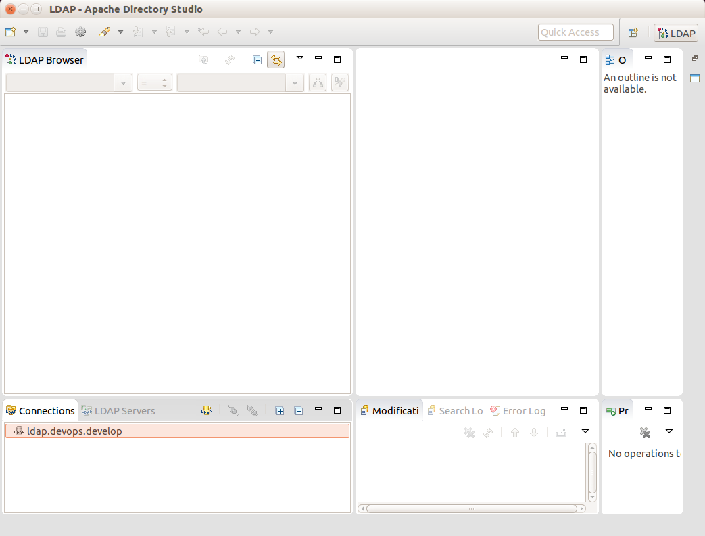

.. _onboarding:

Onboarding Developers
=====================

This chapter covers the process for onboarding new developers to
provide them access to DevOps components necessary to work on
elements of a DIMS deployment. In short, developers (and
system administrators) will need the following:

    * An account in the Trident portal system for access to email
      lists, etc.

    * A GPG/PGP key pair. The public key will be loaded into the Trident
      portal so others can access the key and so it can be used for
      encrypted email.

    * A Google account for OpenID Connect authentication used for
      single-signon access to internal resources, along with an
      LDAP database entry that links to this Google account.

    * SSH public/private key pairs allowing access to Git repositories,
      Ansible control host, DIMS system components, etc.

    * Initial copies of Git repositories used to develop and build
      a DIMS deployment instance.

Once all of these resources have been procured, developers or system
administrators are ready to work on a DIMS instance.

.. _initialaccountsetup:

Initial Account Setup
---------------------

The first step in adding a new DIMS developer is getting them set up
with an account on our internal ``ops-trust`` portal instance.

.. note::

    We will transition to using Trident, rather than the old Ops-Trust
    portal code base initially set up for this project, as soon as
    we are able. Trident has an internal wiki, so the FosWiki server mentioned
    here will also be retired.

..

Our FosWiki server has a page that was dedicated to the steps necessary
for `Provisioning New DIMS Users`_.

.. _Provisioning New DIMS Users: http://foswiki.devops.develop/Development/ProvisionNewUsers

.. caution::

    The FosWiki page `Provisioning New DIMS Users`_ looks like it may be out of
    date, or include steps that may not be necessary for just adding a new
    user. It has a huge number of steps that should be made more streamlined
    or added to the DIMS web app to simplify the process of adding and removing
    DIMS users in concert with the ``ops-trust`` portal at the center of DIMS.

..

Once the user has been given their password to the ``ops-trust`` portal,
they need to change their ``MemberID`` to match the account name that
should be used within DIMS. (E.g., Dave Dittrich may be given the
``MemberID`` of ``davedittrich2475`` by the portal, but the desired
account name within DIMS subsystems should be ``dittrich``.)

GPG Encryption Keys for Email, etc.
-----------------------------------

Each ``ops-trust`` portal account holder needs a GPG key to be able to
send/receive encrypted emails. In normal operation, one's ``ops-trust``
portal account is not fully enabled until the user has uploaded their
GPG key.

One of the easiest ways to process GPG-encrypted email is using `Enigmail`_
with the `The GNU Privacy Guard`_ from the `Thunderbird`_ email client. Follow
the `Enigmail Quick Start Guide`_ to install, configure, and generate a GPG key
for use with `Thunderbird`_ (which is supported on Mac, Linux, and Windows, and
is installed by default on the DIMS Ubuntu developer laptops).

After you have set up `The GNU Privacy Guard`_ and uploaded your key,
log in to the ``ops-trust`` portal and select ``PGP Keys`` from the menu
on the left of the screen to download all GPG keys for other portal
users and all email lists to which you subscribe.

.. note::

    This step will only download keys that are in the system at the time
    you press the link, which means they will get out-of-date with respect
    to new users, regenerated keys, and/or new email lists that may be
    created over time. Get in the habit of updating your GPG key ring
    regularly, or at least remember that failure to encrypt/decrypt
    and email may be due to your keyring being out of date and needing
    a refresh.

..

.. _Enigmail: https://www.enigmail.net/home/index.php
.. _The GNU Privacy Guard: https://www.gnupg.org
.. _Enigmail Quick Start Guide: https://www.enigmail.net/documentation/quickstart.php
.. _Thunderbird: https://www.mozilla.org/en-US/thunderbird/

.. _creatingaccounts:

Creating accounts
-----------------

After a new user has successfully set up their ``ops-trust`` portal
account and modified their ``MemberID`` to align with their desired DIMS
account name, they must be added to the ``dims_users`` array in
the ``$GIT/ansible-playbooks/group_vars/all`` file. Once added,
the Ansible playbook roles that generate DIMS user accounts
(e.g., ``dims-users-create``) can be played to create accounts
as needed.

.. todo::

    This step should be automated, so that adding (or removing) a user
    from the DIMS system triggers account creation (or archiving and deletion)
    automatically on DIMS-OPS systems. DIMS-DevOps systems may need to have
    this step be done manually, or triggered by adding/removing the user to/from
    one of the DevOps related trust groups.

    One method for automating this is to replace the hard-coded ``dims_users`` variable
    with a Jinja2 template, then extract the list of users from the ``ops-trust`` portal
    via an RPC call from a Python script that performs the Jinja2 template substitution
    immediately before running Ansible playbooks to create users. (A separate step
    to archive/delete terminated user accounts would be triggered by deletion
    events in the ``ops-trust`` portal, or from an administration panel accessible
    only to users in the "admin" group in the DIMS web application.)

    See :ref:`dimssr:dimssystemrequirements` sections :ref:`dimssr:accountAccessControls`,
    :ref:`dimssr:diutUserStory5`, and :ref:`dimssr:accountSuspension`, and
    JIRA Epic `DIMS-64`_.

..

.. _DIMS-64: http://jira.devops.develop/browse/DIMS-64

.. _sshkeys:

Installing initial SSH key(s)
-----------------------------

Before someone can clone Git repositories, or use SSH to log in to DIMS
systems for interactive shell access, they must (a) have a DIMS SSH key,
and (b) have the public key and ``authorized_keys`` file(s) on target
systems set up properly.

#. Create the user's DIMS SSH key pair...

   .. todo::

      Replace this with example...

      make key
      git commit it

   ..

#. Generate accounts using Ansible playbook ($whatever), which creates
   the accounts and installs their public key.

#. Copy their key pair into the account on the system where they will be
   doing their development (i.e., a DIMS developer laptop, Vagrant virtual
   machine, or bare-metal workstation.) Also make sure their key is
   included in the ``authorized_keys`` file in the ``git`` account on
   ``git.devops.develop`` in order for them to be able to read/write
   source code using Git.

   .. todo::

      Replace this with example...

   ..

#.  Trigger a Jenkins build job for `public-keys-configure`_ to push the
    new user's key to all DIMS-DevOps and DIMS-OPS systems.

    .. todo::

        This step could be added to a script, which invokes the job using
        the REST API. That saves the manual step of clicking the
        *Build Now* button in a browser.

    ..

#.  Set the password on the account they are supposed to use so they can log in to it,
    and/or securely transfer their public SSH key to them so they can use it
    to access the account without needing a password.

    .. note::

        They will need a password on the account for ``sudo`` on commands
        like ``dims-ci-utils.install.user`` that ask for the ``sudo``
        password in order to pass it to Ansible.

    ..

   Use command ``passwd <username>``.

   .. code-block:: none

      [dimsenv] mboggess@b52:~ () $ passwd mboggess
      Changing password for mboggess.
      (current) UNIX password: 
      Enter new UNIX password: 
      Retype new UNIX password: 
      passwd: password updated successfully

   ..

.. _public-keys-configure: http://jenkins.devops.develop/job/public-keys-configure/

.. _remoteaccountsetup:

Remote Account Setup
--------------------

This section details how to set up a new account for a current developer
on a remote machine, after being logged in to the remote machine.

Change password
~~~~~~~~~~~~~~~

Use command ``passwd <username>``.

.. code-block:: none

   [dimsenv] mboggess@b52:~ () $ passwd mboggess
   Changing password for mboggess.
   (current) UNIX password: 
   Enter new UNIX password: 
   Retype new UNIX password: 
   passwd: password updated successfully

..

Transfer SSH Keys to Remote Machine
~~~~~~~~~~~~~~~~~~~~~~~~~~~~~~~~~~~

*  Once logged in to remote machine, check ~/.ssh/authorized_keys file 
   for public key:

   .. code-block:: none

      [dimsenv] mboggess@b52:~ () $ cd .ssh
      [dimsenv] mboggess@b52:~/.ssh () $ ls
      authorized_keys  config  known_hosts
      [dimsenv] mboggess@b52:~/.ssh () $ vim authorized_keys

   ..

*  Securely transfer DIMS RSA keys from local machine to remote machine

   Keys are located in ``~/.ssh/`` and should be named:

   * ``dims_${dimsusername}_rsa`` for private key
   * ``dims_${dimsusername}rsa.pub`` for public key
   * ``dims_${dimsusername}_rsa.sig`` for signature

   Copy all three files from local machine with DIMS RSA keys:

   .. code-block:: none

      [dimsenv] mboggess@dimsdev2:~ () $ cd .ssh
      [dimsenv] mboggess@dimsdev2:~/.ssh () $ scp dims_mboggess_rsa* mboggess@b52.tacoma.uw.edu:/home/mboggess/.ssh/
      dims_mboggess_rsa                                     100% 1675     1.6KB/s   00:00
      dims_mboggess_rsa.pub                                 100%  403     0.4KB/s   00:00
      dims_mboggess_rsa.sig                                 100%   82     0.1KB/s   00:00

   ..

   Check on remote machine:

   .. code-block:: none

      [dimsenv] mboggess@b52:~/.ssh () $ ls
      authorized_keys  dims_mboggess_rsa      dims_mboggess_rsa.sig
      config           dims_mboggess_rsa.pub  known_hosts

   ..

.. note::

   This solves the "second hop issue": a user can access machines one hop
   away because the necessary keys are available on their local machine,
   but when trying to go one hop further, keys are not available. For 
   example, I can log in to b52 just fine, but when I try to run 
   ``dims.git.syncrepos``, which requires access to 
   ``git.devops.develop``, I ran into trouble because my keys 
   were not on b52.

..

Sync Repos on Remote Machine
~~~~~~~~~~~~~~~~~~~~~~~~~~~~

There probably will not be a .mrconfig file on the remote machine,
so you must create an empty file with that name before you sync repos
or the command will fail.

Failure when running ``dims.git.syncrepos`` because no .mrconfig:

.. code-block:: none

   <snip>

   [+++] Adding Repo[49] umich-botnets to /home/mboggess/dims/.mrconfig and checking it out.
   cp: cannot stat ‘/home/mboggess/dims/.mrconfig’: No such file or directory

   [+++] Updated 49 of 49 available repos.
   [+++] Summary of actions for repos that were updated:
   - Any changes to branches at origin have been downloaded to your local repository
   - Any branches that have been deleted at origin have also been deleted from your local repository
   - Any changes from origin/master have been merged into branch 'master'
   - Any changes from origin/develop have been merged into branch 'develop'
   - Any resolved merge conflicts have been pushed back to origin
   [+++] Added 49 new repos: ansible-inventory ansible-playbooks cif-client cif-java configs dims dims-ad dims-adminguide dims-asbuilt dims-ci-utils dims-dashboard dims-db-recovery dims-devguide dims-dockerfiles dims-dsdd dims-jds dims-keys dims-ocd dims-packer dims-parselogs dims-sample-data dims-sr dims-supervisor dims-svd dimssysconfig dims-test-repo dims-tp dims-tr dims-vagrant ELK fuse4j ipgrep java-native-loader java-stix-v1.1.1 mal4s MozDef ops-trust-openid ops-trust-portal poster-deck-2014-noflow prisem prisem-replacement pygraph rwfind sphinx-autobuild stix-java ticketing-redis tsk4j tupelo umich-botnets
   [+++] Updating repos took 00:00:00

..

Looking in ~/dims/ for .mrconfig:

.. code-block:: none

   [dimsenv] mboggess@b52:~ () $ cd dims
   [dimsenv] mboggess@b52:~/dims () $ ls -a
   .  ..  git

..

*  Create .mrconfig

   .. code-block:: none
 
      [dimsenv] mboggess@b52:~/dims () $ touch .mrconfig
      [dimsenv] mboggess@b52:~/dims () $ ls -a
      .  ..  git  .mrconfig
   
   ..

*  Run dims.git.syncrepos

   .. code-block:: none
   
      [dimsenv] mboggess@b52:~/dims () $ cd ..
      [dimsenv] mboggess@b52:~ () $ dims.git.syncrepos
      [+++] Found 49 available repos at git@git.devops.develop
      [+++] Adding Repo[1] ansible-inventory to /home/mboggess/dims/.mrconfig and checking it out.
      mr checkout: /home/mboggess/dims/git/ansible-inventory
      Cloning into 'ansible-inventory'...
      remote: Counting objects: 481, done.
      remote: Compressing objects: 100% (387/387), done.
      remote: Total 481 (delta 237), reused 122 (delta 65)
      Receiving objects: 100% (481/481), 62.36 KiB | 0 bytes/s, done.
      Resolving deltas: 100% (237/237), done.
      Checking connectivity... done.
      Using default branch names.
      
      Which branch should be used for tracking production releases?
         - master
      Branch name for production releases: [master]
      Branch name for "next release" development: [develop]
      
      How to name your supporting branch prefixes?
      Feature branches? [feature/]
      Release branches? [release/]
      Hotfix branches? [hotfix/]
      Support branches? [support/]
      Version tag prefix? []
      
      mr checkout: finished (1 ok)
      
      <snip>
      
      [+++] Updated 49 of 49 available repos.
      [+++] Summary of actions for repos that were updated:
      - Any changes to branches at origin have been downloaded to your local repository
      - Any branches that have been deleted at origin have also been deleted from your local repository
      - Any changes from origin/master have been merged into branch 'master'
      - Any changes from origin/develop have been merged into branch 'develop'
      - Any resolved merge conflicts have been pushed back to origin
      [+++] Added 49 new repos: ansible-inventory ansible-playbooks cif-client cif-java configs dims dims-ad dims-adminguide dims-asbuilt dims-ci-utils dims-dashboard dims-db-recovery dims-devguide dims-dockerfiles dims-dsdd dims-jds dims-keys dims-ocd dims-packer dims-parselogs dims-sample-data dims-sr dims-supervisor dims-svd dimssysconfig dims-test-repo dims-tp dims-tr dims-vagrant ELK fuse4j ipgrep java-native-loader java-stix-v1.1.1 mal4s MozDef ops-trust-openid ops-trust-portal poster-deck-2014-noflow prisem prisem-replacement pygraph rwfind sphinx-autobuild stix-java ticketing-redis tsk4j tupelo umich-botnets
      [+++] Updating repos took 00:07:19
   
   ..

Build Python Virtual Environment on Remote Machine
~~~~~~~~~~~~~~~~~~~~~~~~~~~~~~~~~~~~~~~~~~~~~~~~~~

*  When logged in to remote machine, change directories to location of
   virtual environment build scripts: 

   .. code-block:: none
      
      [dimsenv] mboggess@b52:~ () $ cd $GIT/ansible-playbooks
   
   ..

*  Run the DIMS command to build the system virtualenv for access to
    system DIMS commands:

   .. code-block:: none
   
      [dimsenv] mboggess@b52:~/dims/git/ansible-playbooks (develop) $ ./dimsenv.install.system
   
   ..

*  Run ``exec bash`` to refresh:

   .. code-block:: none
   
      [dimsenv] mboggess@b52:~/dims/git/ansible-playbooks (develop) $ exec bash
      [+++] DIMS shell initialization [ansible-playbooks v1.2.107]
      [+++] Sourcing /opt/dims/etc/bashrc.dims.d/bashrc.dims.network ...
      [+++] OpenVPN status:
       * VPN '01_uwapl_daveb52' is running
       * VPN '02_prsm_dave-prisem-2' is running
      [+++] Sourcing /opt/dims/etc/bashrc.dims.d/bashrc.dims.virtualenv ...
      [+++] Activating virtual environment (/home/mboggess/dims/envs/dimsenv) [ansible-playbooks v1.2.107]
      [+++] (Create file /home/mboggess/.DIMS_NO_DIMSENV_ACTIVATE to disable)
      [+++] Virtual environment 'dimsenv' activated [ansible-playbooks v1.2.107]
      [+++] Installed /home/mboggess/dims/envs/dimsenv/bin/dimsenv.install.user
      [+++] Installed /home/mboggess/dims/envs/dimsenv/bin/dimsenv.install.system
      [+++] Sourcing /opt/dims/etc/bashrc.dims.d/git-prompt.sh ...
      [+++] Sourcing /opt/dims/etc/bashrc.dims.d/hub.bash_completion.sh ...
   
   ..
   
   Line "Activating virtual environment" should have path to dimsenv/ 
   via $HOME/dims.

*  Run DIMS command to build user virtualenv:

   .. code-block:: none
   
      [dimsenv] mboggess@b52:~/dims/git/ansible-playbooks (develop) $ ./dimsenv.install.user
   
   ..

*  Run ``exec bash`` to refresh again.

*  Check $HOME/dims/envs/ for dimsenv/ and activation scripts:

   .. code-block:: none
   
      [dimsenv] mboggess@b52:~/dims/git/ansible-playbooks (develop) $ ls $HOME/dims/envs
      dimsenv          initialize    postdeactivate  postmkvirtualenv  preactivate    premkproject     prermvirtualenv
      get_env_details  postactivate  postmkproject   postrmvirtualenv  predeactivate  premkvirtualenv
   
   ..

Transfer Config Files
~~~~~~~~~~~~~~~~~~~~~

*  Your account personalization files need to be transferred to the
   remote machine as well, including .gitconfig, .vimrc, and 
   .bash_aliases.

   From the local machine:

   .. code-block:: none
   
      [dimsenv] mboggess@dimsdev2:~ () $ scp .bash_aliases mboggess@b52.tacoma.uw.edu:/home/mboggess/
      .bash_aliases                                 100%  510     0.5KB/s   00:00    
      [dimsenv] mboggess@dimsdev2:~ () $ scp .gitconfig mboggess@b52.tacoma.uw.edu:/home/mboggess/
      .gitconfig                                    100%  847     0.8KB/s   00:00    
      [dimsenv] mboggess@dimsdev2:~ () $ scp .vimrc mboggess@b52.tacoma.uw.edu:/home/mboggess/
      .vimrc                                        100%  314     0.3KB/s   00:00      
      
   ..

   On the remote machine, check for files and refresh bash:

   .. code-block:: none

      [dimsenv] mboggess@b52:~ () $ ls -a
      .   .ansible       .bash_history  .bashrc  dims              .gitconfig  .profile      .ssh      .vimrc
      ..  .bash_aliases  .bash_logout   .cache   examples.desktop  .mrtrust    .python-eggs  .viminfo
      [dimsenv] mboggess@b52:~ () $ exec bash
      
   ..

.. _jiraonboarding:

Jira Onboarding
---------------

.. _ldapconfig:

Adding LDAP Entries for Users
~~~~~~~~~~~~~~~~~~~~~~~~~~~~~

We have an OpenLDAP server which serves as an authorization backend for our
LemonLDAP SSO. Authentication is provided by OpenID Connect. It also serves as
the user directory for JIRA.

.. note::

   You will need an application to be able to edit/add directory information.
   `Apache Directory Studio`_ is cross platform and recommended. Ideally,
   the Trident portal would directly feed these records, rather than requiring
   someone follow the lengthly steps outlined below using a more laborious
   graphical user interface.

   An Ansible role ``apache-directory-studio`` is used to install this
   application. Once this role has been applied, you can start the
   GUI with the following command:

   .. code-block:: none

       $ apache-directory-studio &

   ..

   The first time the program is run, a connection must be configured for
   the project LDAP server. Follow the instructions in :ref:`apacheDirectoryStudioSetup`
   to create the initial connection.

   .. attention::

      When starting Adobe Directory Studio from the command line, you *must* add
      the ``&`` to run the program in the background. Since this is not
      a terminal program that takes input at the command line, failing to background
      the process will result in the shell not returning to a command prompt
      until after you quit the application, which novice Linux users unfamiliar
      with command shells and background processes will interpret as the terminal
      window being "hung" or "frozen".

    ..

..

.. _Apache Directory Studio: http://directory.apache.org/studio/

After Adobe Directory Studio has been installed and configured, start the
application. You should see the initial connection in the list:

   Initial LDAP Browser Connection list

..

   #. Click on the connection in the **Connections** list. (If you followed the
      instructions in :ref:`apacheDirectoryStudioSetup`, the connection you want is
      labelled ``ldap.devops.develop``.

   #. Click to open **DIT** in the tree.

      .. figure:: images/apache-directory-studio-browser.png
         :width: 65%
         :align: center

         DIT for connection ``ldap.devops.develop``

      ..

   #. Click to open **dc=prisem,dc=washington,dc=edu** in the tree.

   #. Click to open **ou=Users** in the tree. The current users will display.

   #. Right-click **ou=Users** to open context menu and click **New** -> **New Entry**.

   #. Select **Use existing entry as template**. Click **Browse** button to
      open the **ou** and select a member.

   #. Click **Next**.

   #. In the **Object Classes** dialog, do not add any more object classes. Just
      click **Next**.

      .. figure:: images/apache-directory-studio-objectclasses.png
         :width: 65%
         :align: center

         Object Classes (skip)

      ..

   #. In the **Distinguished Name** dialog, replace the template user's name
      you selected with the new user's name. The **DN** preview should then look like
      **cn=new_user_name,ou=Users,dc=prisem,dc=washington,dc=edu**.

      .. figure:: images/apache-directory-studio-dn.png
         :width: 65%
         :align: center

         Distinguished Name dialog

      ..

   #. Click **Next**.

   #. In the **Attribute Description** dialog (center panel), replace the template
      values with the values for your new user. Double click
      each **Valuefield** to edit.

      .. figure:: images/apache-directory-studio-attributes.png
         :width: 65%
         :align: center

         Attribute Description dialog

      ..

      .. note::

         Tab to the next field or the value you entered might not be saved.

      ..

      * **sn** - Enter the user's Last name
      * **displayName** - Enter the user's First and Last name
      * **mail** - Enter the user's Gmail address using for authenticating with
        OpenID Connect authentication.
      * **ssoRoles** - These are used for testing right now (you can leave them as is.)
      * **uid** - enter the uid in the form **firstname.lastname**
      * **userPassword** - enter a password. It will be hashed.

   #. Click **Finish**.

   #. Click on the new member and verify the fields. Edit any that were not entered correctly.

Exit the application when your are done and have the user test the authentication
by going to ``http://jira.prisem.washington.edu/`` and select **Google** in the
the **OpenID Login** dialog:

      .. figure:: images/jira-login.png
         :width: 65%
         :align: center

         JIRA Dashboard Login screen

      ..

.. note::

   Google OpenID requires that the domain name of the system requesting authentication
   have a valid public DNS name. Even though you can connect to the system from within the
   VPN/VLAN via a non-public DNS name lookup, the authentication will not work. For this
   reason, the name ``jira.prisem.washington.edu`` is mapped in the split-horizon DNS
   mappings.

..

If the user has not recently authenticated to Google, they will be prompted for their
password and/or second-factor authentication information. Once authenticated, the
JIRA Dashboard will pop up.

Adding Users to Jira Groups
~~~~~~~~~~~~~~~~~~~~~~~~~~~

Actual documentation for this section will be added, but for now, here is
an email from Linda Parsons, in response to a query by Megan Boggess asking
how a new DIMS member is given initial access to the DIMS Jira "artifacts"
(Scrum board, issues, etc.). 

.. code-block:: none

    You need to add the new user to groups in JIRA. Unfortunately, I don't
    remember exactly how - would know if I could see the app... However,
    you need to be a JIRA administrator to do it. I know Dave has that
    access - maybe you do too. There is a link somewhere to do admin stuff -
    you can google how to use it by searching for JIRA add user to group or
    something like that. (There is a menu I think near the top right to
    access admin functions.)

    If you can get to the Users section, then you can see the users already
    in the system and what groups they are in. You can also look up what
    the permissions are for each group. Probably JIRA-developer group would
    be sufficient.

    Also, we only have a license for 10 users...

    One caveat - the Google sign-in for JIRA does not appear to work to get
    to the Admin options. (If you click on a link or menu item to do anything
    administratively it will ask you to verify your authentication.) So when
    I did it, I had to use my username and password entered in LDAP. So the
    rub is that there are passwords in there, but we don't use them for anything
    else. You probably should, for whoever is doing the administrative work,
    change that user's password in LDAP so they know what it is. Does that make
    sense? We just don't have any LDAP front-end except the Apache Directory
    program (I forget its exact name) to make those changes.

..
