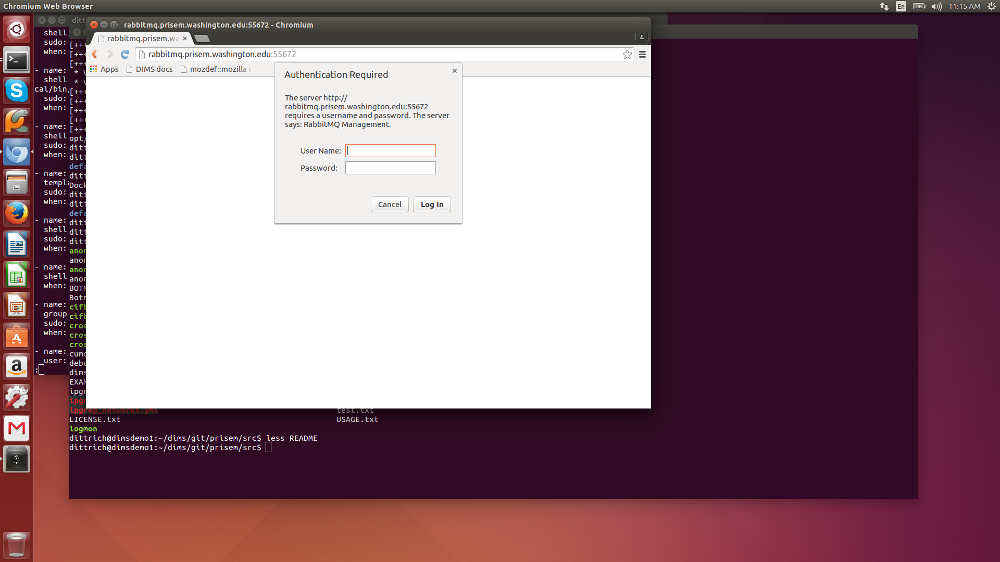
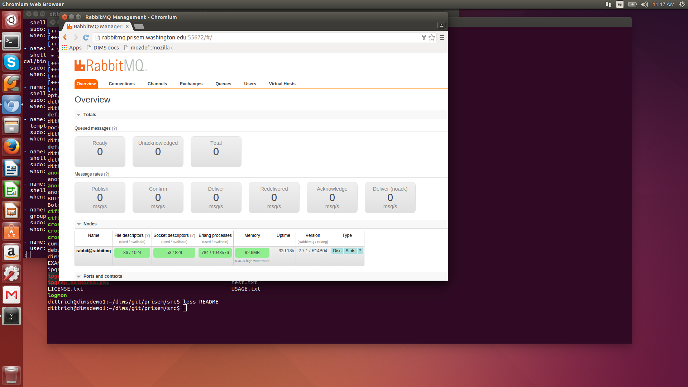

.. _amqpandrabbitmq:

AMQP and RabbitMQ
=================

This chapter covers configuration and debugging of
`RabbitMQ`_, a popular `AMQP`_ message bus service.

.. _RabbitMQ: https://www.rabbitmq.com/
.. _AMQP: https://www.amqp.org/

.. _rabbitmqindims:

RabbitMQ use in DIMS
--------------------

AMQP (specifically `RabbitMQ`_) is discussed in Sections
:ref:`dimsad:dimsarchitecturaldesign` and :ref:`dimsad:dimscomponents` of
:ref:`dimsad:dimsarchitecturedesign`, and the specifics of the server
initially configured for use in DIMS is documented in Section
:ref:`dimsasbuilt:rabbitmq` of :ref:`dimsasbuilt:dimsasbuilt`.  Its use for
processing logs within DIMS is discussed in Section
:ref:`dimsparselogs:introtologparsing` of
:ref:`dimsparselogs:parsinglogswithdims`.

.. todo::

    Section :ref:`dimsasbuilt:rabbitmq` of :ref:`dimsasbuilt:dimsasbuilt` is empty,
    but this cross-reference is here for completeness

..

.. attention::

    While `RabbitMQ`_ is documented extensively on their web site, it is
    sometimes hard to interpret what it says. Another very useful resource is
    `Chapter 8: Administering RabbitMQ from the Web`_ from `RabbitMQ in Action:
    Distributed messaging for everyone`_, by Alvaro Videla and Jason J. W.
    Williams.

..

.. _Chapter 8\: Administering RabbitMQ from the Web: https://manning-content.s3.amazonaws.com/download/8/f54cf20-1743-4c00-b48a-95a86866bd22/RabbitMQ_sampleCH08.pdf
.. _RabbitMQ in Action\: Distributed messaging for everyone: https://www.manning.com/books/rabbitmq-in-action

.. _basicservice:

Basic Service Administration
----------------------------

`RabbitMQ`_ is started/stopped/restarted/queried for status just like any other
Ubuntu service using the ``service`` command as root. Its configuration files
and settings are found in ``/etc/rabbitmq`` and
``/etc/default/rabbitmq-server``, and its log files in ``/var/log/rabbitmq/``.

.. code-block:: none

    root@rabbitmq:~# cd /etc/rabbitmq
    root@rabbitmq:/etc/rabbitmq# tree
    .
    ├── enabled_plugins
    ├── rabbitmq.config
    ├── rabbitmq.conf.d
    └── rabbitmq-env.conf

    1 directory, 3 files

..

.. code-block:: none

    root@rabbitmq:/etc/rabbitmq# cat rabbitmq.config
    [
    {kernel,
    [{inet_dist_listen_min, 45000},
    {inet_dist_listen_max, 45000}
    ]
    }
    ].

..

.. code-block:: none

    root@rabbitmq:/var/log/rabbitmq# cat /etc/default/rabbitmq-server
    ulimit -n 1024

..

.. note::

    The ``ulimit`` setting here controls the number of open file
    handles a process can have. A server with lots of connections
    needs a higher limit than the default, hence this setting.
    See `[rabbitmq-discuss] Increasing the file descriptors limit`_
    and `mozilla/opsec-puppet`_ and `Increase RabbitMQ file descriptor limit
    and memory watermark without restart`_.

    .. code-block:: none

        root@b52:/etc/rabbitmq# rabbitmqctl status | grep -A 4 file_descriptors
         {file_descriptors,
              [{total_limit,924},{total_used,3},{sockets_limit,829},{sockets_used,1}]},
         {processes,[{limit,1048576},{used,200}]},
         {run_queue,0},
         {uptime,82858}]

    ..

..

.. _[rabbitmq-discuss] Increasing the file descriptors limit: http://lists.rabbitmq.com/pipermail/rabbitmq-discuss/2013-January/024990.html
.. _mozilla/opsec-puppet: https://github.com/mozilla/opsec-puppet/commit/3dfa554b9616c452e26cdf9391ff78226796d9d7
.. _Increase RabbitMQ file descriptor limit and memory watermark without restart: https://jsosic.wordpress.com/2014/09/10/increase-rabbitmq-file-descriptor-limit-without-restart/

.. code-block:: none

    root@rabbitmq:/etc/rabbitmq# cd /var/log/rabbitmq
    root@rabbitmq:/var/log/rabbitmq# tree
    .
    ├── rabbit@rabbitmq.log
    ├── rabbit@rabbitmq-sasl.log
    ├── shutdown_log
    └── startup_log

    0 directories, 4 files

..

.. TODO(dittrich)
.. todo::

    The configuration files shown above should be managed by Ansible.
    See Jira Ticket `DIMS-333`_. Remove this ``todo::`` block when
    that ticket is resolved.

..

.. _DIMS-333: http://jira.prisem.washington.edu/browse/DIMS-333

.. _managingrabbitmq:

Managing RabbitMQ
-----------------

`RabbitMQ`_ can be administered in two ways: (1) manually, using the built-in
web interface, or (2) using command line tools like ``rabbitmqctl`` and
``rabbitmqadmin``.

To get access to the management interface, you must enabled
``rabbitmq_management`` in the `RabbitMQ`_ configuration:

.. code-block:: none
   :emphasize-lines: 4

    root@rabbitmq:/etc/rabbitmq# cat rabbitmq-env.conf
    #RABBITMQ_NODE_IP_ADDRESS=10.142.29.170
    RABBITMQ_NODE_PORT=5672
    RABBITMQ_SERVER_START_ARGS="-rabbitmq_management listener [{port,15672}]"

    # Source other environment files (that include ONLY variable settings,
    # not RabbitMQ configuration
    for ENVFILE in `ls /etc/rabbitmq/rabbitmq.conf.d |sort -r`; do
        . /etc/rabbitmq/rabbitmq.conf.d/$ENVFILE
        done

..

Once you do this, and restart the server, two things become
available. The first is a web interface, and the second is access to a
downloadable (from the `RabbitMQ`_ server itself) script named
``rabbitmqadmin``.

.. _usingthewebinterface:

Using the web interface
~~~~~~~~~~~~~~~~~~~~~~~

You can see the web management interface in
Figure :ref:`rabbitmqmanagementlogin` and Figure
Figure :ref:`rabbitmqmanagementhome`.

.. _rabbitmqmanagementlogin:

   RabbitMQ Mangement Interface Login Screen

..

.. _rabbitmqmanagementhome:

   RabbitMQ Mangement Interface Home Screen

..

.. _usingthecommandline:

Using the command line
~~~~~~~~~~~~~~~~~~~~~~

The `RabbitMQ`_ service daemons are started like any other
service on Ubuntu 14.04.

.. code-block:: none

    root@b52:~# service rabbitmq-server restart
     * Restarting message broker rabbitmq-server
       ...done.

..

There are multiple ways with Linux to discover the listening port number. You
can identify the process names with ``ps`` or ``pstree`` to map to output of
``netstat``, use ``lsof``, and the ``epmd`` command:

.. code-block:: none

    root@b52:~# pstree -p | less
    init(1)-+- ...
            |-lightdm(2599)-+-Xorg(2648)
            |  ...
            |               |-lightdm(3363)-+-init(4946)-+-at-spi-bus-laun(5140)-+-dbus-daemon(5144)
            |               |               |            |-rabbitmq-server(19303)---beam.smp(19311)-+-inet_gethost(19492)---inet_gethos+
            |               |               |            |                                          |-{beam.smp}(19408)
            |               |               |            |                                          |-{beam.smp}(19409)
            |               |               |            |                                          | ...
            |               |               |            |                                          |-{beam.smp}(19451)
            |               |               |            |                                          `-{beam.smp}(19452)
            | ...

..

.. code-block:: none

    root@b52:~# netstat -pan | grep beam
    tcp        0      0 0.0.0.0:45000           0.0.0.0:*               LISTEN      19311/beam.smp
    tcp        0      0 127.0.0.1:51156         127.0.0.1:4369          ESTABLISHED 19311/beam.smp
    tcp6       0      0 :::5672                 :::*                    LISTEN      19311/beam.smp

..

.. code-block:: none

    root@b52:~# lsof -i | grep beam
    beam.smp  19311        rabbitmq    8u  IPv4 27589259      0t0  TCP *:45000 (LISTEN)
    beam.smp  19311        rabbitmq    9u  IPv4 27589261      0t0  TCP localhost:51156->localhost:epmd (ESTABLISHED)
    beam.smp  19311        rabbitmq   16u  IPv6 27580219      0t0  TCP *:amqp (LISTEN)

..

.. code-block:: none

    root@b52:~# epmd -names
    epmd: up and running on port 4369 with data:
    name rabbit at port 45000

..

There are two ways of getting the exact same information on
the runtime status of `RabbitMQ`_. The first uses ``rabbitmqctl``
directly. The second uses ``service rabbitmq-server status``.
They are both shown here:

.. code-block:: none
   :emphasize-lines: 1

    root@rabbitmq:/etc/rabbitmq# rabbitmqctl status
    Status of node rabbit@rabbitmq ...
    [{pid,8815},
     {running_applications,
         [{rabbitmq_management,"RabbitMQ Management Console","0.0.0"},
          {rabbitmq_management_agent,"RabbitMQ Management Agent","0.0.0"},
          {amqp_client,"RabbitMQ AMQP Client","0.0.0"},
          {rabbit,"RabbitMQ","2.7.1"},
          {os_mon,"CPO  CXC 138 46","2.2.7"},
          {sasl,"SASL  CXC 138 11","2.1.10"},
          {rabbitmq_mochiweb,"RabbitMQ Mochiweb Embedding","0.0.0"},
          {webmachine,"webmachine","1.7.0-rmq0.0.0-hg"},
          {mochiweb,"MochiMedia Web Server","1.3-rmq0.0.0-git"},
          {inets,"INETS  CXC 138 49","5.7.1"},
          {mnesia,"MNESIA  CXC 138 12","4.5"},
          {stdlib,"ERTS  CXC 138 10","1.17.5"},
          {kernel,"ERTS  CXC 138 10","2.14.5"}]},
     {os,{unix,linux}},
     {erlang_version,
         "Erlang R14B04 (erts-5.8.5) [source] [64-bit] [smp:16:16] [rq:16] [async-threads:30] [kernel-poll:true]\n"},
     {memory,
         [{total,31080064},
          {processes,11445592},
          {processes_used,11433880},
          {system,19634472},
          {atom,1336577},
          {atom_used,1313624},
          {binary,117880},
          {code,14301212},
          {ets,1142776}]},
     {vm_memory_high_watermark,0.39999999996434304},
     {vm_memory_limit,6730807705}]
    ...done.

..

.. code-block:: none
   :emphasize-lines: 1

    root@rabbitmq:/etc/rabbitmq# service rabbitmq-server status
    Status of node rabbit@rabbitmq ...
    [{pid,8815},
     {running_applications,
         [{rabbitmq_management,"RabbitMQ Management Console","0.0.0"},
          {rabbitmq_management_agent,"RabbitMQ Management Agent","0.0.0"},
          {amqp_client,"RabbitMQ AMQP Client","0.0.0"},
          {rabbit,"RabbitMQ","2.7.1"},
          {os_mon,"CPO  CXC 138 46","2.2.7"},
          {sasl,"SASL  CXC 138 11","2.1.10"},
          {rabbitmq_mochiweb,"RabbitMQ Mochiweb Embedding","0.0.0"},
          {webmachine,"webmachine","1.7.0-rmq0.0.0-hg"},
          {mochiweb,"MochiMedia Web Server","1.3-rmq0.0.0-git"},
          {inets,"INETS  CXC 138 49","5.7.1"},
          {mnesia,"MNESIA  CXC 138 12","4.5"},
          {stdlib,"ERTS  CXC 138 10","1.17.5"},
          {kernel,"ERTS  CXC 138 10","2.14.5"}]},
     {os,{unix,linux}},
     {erlang_version,
         "Erlang R14B04 (erts-5.8.5) [source] [64-bit] [smp:16:16] [rq:16] [async-threads:30] [kernel-poll:true]\n"},
     {memory,
         [{total,31103832},
          {processes,11469280},
          {processes_used,11457568},
          {system,19634552},
          {atom,1336577},
          {atom_used,1313689},
          {binary,117880},
          {code,14301212},
          {ets,1142776}]},
     {vm_memory_high_watermark,0.39999999996434304},
     {vm_memory_limit,6730807705}]
    ...done.

..

The following shows how to get a copy of the ``rabbitmqadmin`` script
and make it executable from the command line.

.. code-block:: none

    root@rabbitmq:/etc/rabbitmq# wget http://localhost:55672/cli/rabbitmqadmin
    root@rabbitmq:/etc/rabbitmq# chmod +x rabbitmqadmin

..

.. note::

    These steps should be done immediately after initial `RabbitMQ`_
    installation when creating Ansible playbooks, the script turned
    into a Jinja2 template, and installed into the $PATH for
    direct access from the command line (as opposed to being
    run with a relative path after changing directory into
    the ``/etc/rabbitmq`` directory as shown here).

..

The ``rabbitmqadmin`` script has a ``help`` option that provides
information on how to use it.

.. code-block:: none

    root@rabbitmq:/etc/rabbitmq# ./rabbitmqadmin help subcommands
    Usage
    =====
      rabbitmqadmin [options] subcommand
    
      where subcommand is one of:
    
    Display
    =======
    
      list users [<column>...]
      list vhosts [<column>...]
      list connections [<column>...]
      list exchanges [<column>...]
      list bindings [<column>...]
      list permissions [<column>...]
      list channels [<column>...]
      list parameters [<column>...]
      list queues [<column>...]
      list policies [<column>...]
      list nodes [<column>...]
      show overview [<column>...]
    
    Object Manipulation
    ===================
    
      declare queue name=... [node=... auto_delete=... durable=... arguments=...]
      declare vhost name=... [tracing=...]
      declare user name=... password=... tags=...
      declare exchange name=... type=... [auto_delete=... internal=... durable=... arguments=...]
      declare policy name=... pattern=... definition=... [priority=... apply-to=...]
      declare parameter component=... name=... value=...
      declare permission vhost=... user=... configure=... write=... read=...
      declare binding source=... destination=... [arguments=... routing_key=... destination_type=...]
      delete queue name=...
      delete vhost name=...
      delete user name=...
      delete exchange name=...
      delete policy name=...
      delete parameter component=... name=...
      delete permission vhost=... user=...
      delete binding source=... destination_type=... destination=... properties_key=...
      close connection name=...
      purge queue name=...
    
    Broker Definitions
    ==================
    
      export <file>
      import <file>
    
    Publishing and Consuming
    ========================
    
      publish routing_key=... [payload=... payload_encoding=... exchange=...]
      get queue=... [count=... requeue=... payload_file=... encoding=...]
    
      * If payload is not specified on publish, standard input is used
    
      * If payload_file is not specified on get, the payload will be shown on
        standard output along with the message metadata
    
      * If payload_file is specified on get, count must not be set

..

Here ``rabbitmqadmin`` is used to get a list of the currently
defined exchanges:

.. code-block:: none

    root@rabbitmq:/etc/rabbitmq# ./rabbitmqadmin list exchanges
    +-------+--------------------+---------+-------------+---------+----------+
    | vhost |        name        |  type   | auto_delete | durable | internal |
    +-------+--------------------+---------+-------------+---------+----------+
    | /     |                    | direct  | False       | True    | False    |
    | /     | amq.direct         | direct  | False       | True    | False    |
    | /     | amq.fanout         | fanout  | False       | True    | False    |
    | /     | amq.headers        | headers | False       | True    | False    |
    | /     | amq.match          | headers | False       | True    | False    |
    | /     | amq.rabbitmq.log   | topic   | False       | True    | False    |
    | /     | amq.rabbitmq.trace | topic   | False       | True    | False    |
    | /     | amq.topic          | topic   | False       | True    | False    |
    | /     | devops             | fanout  | False       | True    | False    |
    | /     | log_task           | direct  | False       | True    | False    |
    | /     | logs               | fanout  | False       | False   | False    |
    +-------+--------------------+---------+-------------+---------+----------+

..

We can now define a new ``fanout`` exchange where we can direct log messages for
later processing using ``rabbitmqadmin``, rather than the web interface:

.. code-block:: none

    root@rabbitmq:/etc/rabbitmq# ./rabbitmqadmin declare exchange name=health type=fanout auto_delete=false durable=true internal=false
    exchange declared
    root@rabbitmq:/etc/rabbitmq# ./rabbitmqadmin list exchanges
    +-------+--------------------+---------+-------------+---------+----------+
    | vhost |        name        |  type   | auto_delete | durable | internal |
    +-------+--------------------+---------+-------------+---------+----------+
    | /     |                    | direct  | False       | True    | False    |
    | /     | amq.direct         | direct  | False       | True    | False    |
    | /     | amq.fanout         | fanout  | False       | True    | False    |
    | /     | amq.headers        | headers | False       | True    | False    |
    | /     | amq.match          | headers | False       | True    | False    |
    | /     | amq.rabbitmq.log   | topic   | False       | True    | False    |
    | /     | amq.rabbitmq.trace | topic   | False       | True    | False    |
    | /     | amq.topic          | topic   | False       | True    | False    |
    | /     | devops             | fanout  | False       | True    | False    |
    | /     | health             | fanout  | False       | True    | False    |
    | /     | log_task           | direct  | False       | True    | False    |
    | /     | logs               | fanout  | False       | False   | False    |
    +-------+--------------------+---------+-------------+---------+----------+

..

After creating all of the broker objects we wish to have in the
default server (using either the web interface and/or ``rabbitmqadmin``)
you can ``export`` a JSON file that can be put under Ansible control
for later import into a newly instantiated `RabbitMQ`_ server.
(See `Loading rabbitmq config at startup`.)

.. _Loading rabbitmq config at startup: http://stackoverflow.com/questions/21414364/loading-rabbitmq-config-at-startup

.. caution::

    There are passwords in this output (which are redacted here). Keep
    this file secure and *do not put it in a public source repository*
    without encryption or templating (e.g., with Jinja2).

..

.. code-block:: none

    root@rabbitmq:/etc/rabbitmq# ./rabbitmqadmin export broker-objects.json
    Exported definitions for localhost to "broker-objects.json"
    root@rabbitmq:/etc/rabbitmq# python -m json.tool broker-objects.json
    {
        "bindings": [
            {
                "arguments": {},
                "destination": "log_task",
                "destination_type": "queue",
                "routing_key": "log_task",
                "source": "log_task",
                "vhost": "/"
            },
            {
                "arguments": {},
                "destination": "log_test_queue",
                "destination_type": "queue",
                "routing_key": "",
                "source": "test_exchange",
                "vhost": "/"
            },
            {
                "arguments": {},
                "destination": "taskqueue",
                "destination_type": "queue",
                "routing_key": "",
                "source": "test_exchange",
                "vhost": "/"
            },
            {
                "arguments": {},
                "destination": "test_exchange",
                "destination_type": "queue",
                "routing_key": "test_exchange",
                "source": "test_exchange",
                "vhost": "/"
            }
        ],
        "exchanges": [
            {
                "arguments": {},
                "auto_delete": false,
                "durable": true,
                "internal": false,
                "name": "test_exchange",
                "type": "direct",
                "vhost": "/"
            },
            {
                "arguments": {},
                "auto_delete": false,
                "durable": true,
                "internal": false,
                "name": "devops",
                "type": "fanout",
                "vhost": "/"
            },
            {
                "arguments": {},
                "auto_delete": false,
                "durable": true,
                "internal": false,
                "name": "test",
                "type": "fanout",
                "vhost": "/"
            },
            {
                "arguments": {},
                "auto_delete": false,
                "durable": true,
                "internal": false,
                "name": "health",
                "type": "fanout",
                "vhost": "/"
            },
            {
                "arguments": {},
                "auto_delete": false,
                "durable": false,
                "internal": false,
                "name": "logs",
                "type": "fanout",
                "vhost": "/"
            },
            {
                "arguments": {},
                "auto_delete": false,
                "durable": true,
                "internal": false,
                "name": "log_task",
                "type": "direct",
                "vhost": "/"
            }
        ],
        "permissions": [
            {
                "configure": ".*",
                "read": ".*",
                "user": "rpc_user",
                "vhost": "/",
                "write": ".*"
            },
            {
                "configure": ".*",
                "read": ".*",
                "user": "logmatrix",
                "vhost": "/",
                "write": ".*"
            },
            {
                "configure": ".*",
                "read": ".*",
                "user": "hutchman",
                "vhost": "/",
                "write": ".*"
            }
        ],
        "queues": [
            {
                "arguments": {},
                "auto_delete": false,
                "durable": false,
                "name": "crosscor_test_0.5.5",
                "vhost": "/"
            },
            {
                "arguments": {},
                "auto_delete": false,
                "durable": true,
                "name": "taskqueue",
                "vhost": "/"
            },
            {
                "arguments": {},
                "auto_delete": false,
                "durable": false,
                "name": "cifbulk_v1_0.5.5",
                "vhost": "/"
            },
            {
                "arguments": {},
                "auto_delete": false,
                "durable": true,
                "name": "test_exchange",
                "vhost": "/"
            },
            {
                "arguments": {},
                "auto_delete": false,
                "durable": false,
                "name": "anon_0.5.5",
                "vhost": "/"
            },
            {
                "arguments": {},
                "auto_delete": false,
                "durable": true,
                "name": "log_task",
                "vhost": "/"
            },
            {
                "arguments": {},
                "auto_delete": false,
                "durable": false,
                "name": "cifbulk_v1_test_0.5.5",
                "vhost": "/"
            },
            {
                "arguments": {},
                "auto_delete": false,
                "durable": false,
                "name": "crosscor_0.5.5",
                "vhost": "/"
            },
            {
                "arguments": {},
                "auto_delete": false,
                "durable": true,
                "name": "log_queue_test",
                "vhost": "/"
            },
            {
                "arguments": {},
                "auto_delete": false,
                "durable": true,
                "name": "log_test_queue",
                "vhost": "/"
            },
            {
                "arguments": {},
                "auto_delete": false,
                "durable": false,
                "name": "anon_test_0.5.5",
                "vhost": "/"
            }
        ],
        "rabbit_version": "2.7.1",
        "users": [
            {
                "name": "hutchman",
                "password_hash": "REDACTED",
                "tags": "administrator"
            },
            {
                "name": "logmatrix",
                "password_hash": "REDACTED",
                "tags": "administrator"
            },
            {
                "name": "rpc_user",
                "password_hash": "REDACTED",
                "tags": ""
            }
        ],
        "vhosts": [
            {
                "name": "/"
            }
        ]
    }

..

.. _ansiblecontrol:

Management with Ansible playbooks
---------------------------------

.. todo::

    Playbooks for `RabbitMQ`_ are not yet described in :ref:`ansibleplaybooks:ansibleplaybooks`,
    but can be found in ``$GIT/ansible-playbooks/roles/rabbitmq-*``:

    .. code-block:: none

        [dimsenv] dittrich@b52:ms/git/ansible-playbooks/roles (develop) $ tree rabbitmq-*
        rabbitmq-server-config
        └── tasks
            ├── main.yml
            ├── post_tasks.yml -> ../../../dims/post_tasks.yml
            └── pre_tasks.yml -> ../../../dims/pre_tasks.yml
        rabbitmq-server-install
        └── tasks
            ├── main.yml
            ├── post_tasks.yml -> ../../../dims/post_tasks.yml
            ├── precise.yml
            ├── pre_tasks.yml -> ../../../dims/pre_tasks.yml
            └── trusty.yml
        rabbitmq-server-test
        └── tasks
            └── main.yml

        3 directories, 9 files

    ..

..

