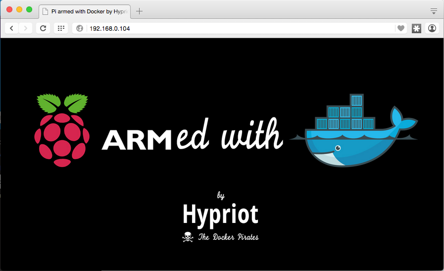

.. _rpidocker:

RaspberryPi and Docker
======================

This chapter covers installing and configuring Docker on a
`RaspberryPi 2`_ for prototyping Docker container microservices
and supporting DIMS deployment using PXE boot support.

.. _RaspberryPi 2: https://www.raspberrypi.org/help/what-is-a-raspberry-pi/

.. TODO(dittrich)
.. todo::

    Put a photo here of Dave's RPi-2.

..

.. _rpiosinstall:

Installing HypriotOS w/Docker
-----------------------------

.. note::

    The Raspberry Pi uses a micro SD card to hold the operating system it will
    boot. To run *any* operating system, you must first create a bootable micro
    SD card. You can find many pages with instructions on `How to Flash an SD
    Card for Raspberry Pi`_. This section uses one such set of instructions
    for a ARM-based Linux distribution with Docker installed on it.

..

.. _How to Flash an SD Card for Raspberry Pi: http://computers.tutsplus.com/articles/how-to-flash-an-sd-card-for-raspberry-pi--mac-53600

The folks at Hypriot have instructions for `Getting started with Docker on your
Raspberry Pi`_, that step through the process of install one of their
pre-configured `SD card images` to your Raspberry Pi. Mac users can take
advantage of a command-line script to flash the SD card image on GitHub in the
repo `hypriot/flash`_.

.. _Getting started with Docker on your Raspberry Pi: http://blog.hypriot.com/getting-started-with-docker-on-your-arm-device/
.. _SD card images: http://blog.hypriot.com/downloads/
.. _hypriot/flash: https://github.com/hypriot/flash

.. code-block:: none

    [dimsenv] dittrich@27b:~/git () $ git clone https://github.com/hypriot/flash.git
    Cloning into 'flash'...
    remote: Counting objects: 100, done.
    remote: Total 100 (delta 0), reused 0 (delta 0), pack-reused 100
    Receiving objects: 100% (100/100), 25.54 KiB | 0 bytes/s, done.
    Resolving deltas: 100% (42/42), done.
    Checking connectivity... done.
    [dimsenv] dittrich@27b:~/git () $ git checkout -b dims
    [dimsenv] dittrich@27b:~/git (dims) $ cd flash
    [dimsenv] dittrich@27b:~/git/flash (dims) $ ls
    AUTHORS         Darwin          LICENSE         Linux           README.md
    [dimsenv] dittrich@27b:~/git/flash (dims) $ tree
    .
    ├── AUTHORS
    ├── Darwin
    │   └── flash
    ├── LICENSE
    ├── Linux
    │   └── flash
    └── README.md

    2 directories, 5 files
    [dimsenv] dittrich@27b:~/git/flash (dims) $ cd Darwin
    [dimsenv] dittrich@27b:~/git/flash/Darwin (dims) $ brew install pv
    ==> Downloading https://homebrew.bintray.com/bottles/pv-1.6.0.yosemite.bottle.1.tar.gz
    brew install awscli/usr/bin/curl -fLA Homebrew 0.9.5 (Ruby 2.0.0-481; OS X 10.10.5) https://homebrew.bintray.com/bottles/pv-1.6.0.yosemite.bottle.1.tar.gz -C 0 -o /Library/Caches/Homebrew/p
    v-1.6.0.yosemite.bottle.1.tar.gz.incomplete
      % Total    % Received % Xferd  Average Speed   Time    Time     Time  Current
                                     Dload  Upload   Total   Spent    Left  Speed
    100 34692  100 34692    0     0  10668      0  0:00:03  0:00:03 --:--:-- 10671
    ==> Verifying pv-1.6.0.yosemite.bottle.1.tar.gz checksum
    ==> Pouring pv-1.6.0.yosemite.bottle.1.tar.gz
    tar xf /Library/Caches/Homebrew/pv-1.6.0.yosemite.bottle.1.tar.gz
    ==> Finishing up
    ln -s ../Cellar/pv/1.6.0/bin/pv pv
    ln -s ../../../Cellar/pv/1.6.0/share/man/man1/pv.1 pv.1
    ==> Summary
    🍺  /usr/local/Cellar/pv/1.6.0: 4 files, 84K

..

If you need to enable wireless, create an ``occidentalis.txt`` file with
the SSID and password for connecting to your wireless access point. PXE
boot over ethernet will use the wired interface, but you may want to enable
wireless for remote management of the Raspberry Pi.

.. code-block:: none

    [dimsenv] dittrich@27b:~/git/flash/Darwin (dims) $ vi occidentalis.txt
    # hostname for your Hypriot Raspberry Pi:
    hostname=dims-rpi

    # basic wireless networking options:
    wifi_ssid=REDACTED
    wifi_password=REDACTED

..

.. note::

    The instructions below assume that you have created an ``occidentalis.txt``
    file. Remove that from the command line if you did not create one.

..

Insert a micro SD card into one of the memory slots and run the ``flash``
script, referencing the most recent version of the ``hypriot-rpi`` image file
from the `SD card images`_ page.

.. code-block:: none

    [dimsenv] dittrich@27b:~/git/flash/Darwin (dims*) $ ./flash -c occidentalis.txt http://downloads.hypriot.com/hypriot-rpi-20151004-132414.img.zip

    Downloading http://downloads.hypriot.com/hypriot-rpi-20151004-132414.img.zip ...
      % Total    % Received % Xferd  Average Speed   Time    Time     Time  Current
                                     Dload  Upload   Total   Spent    Left  Speed
    100  449M  100  449M    0     0  3025k      0  0:02:32  0:02:32 --:--:--  118k
    Uncompressing /tmp/image.img.zip ...
    Archive:  /tmp/image.img.zip
      inflating: /tmp/hypriot-rpi-20151004-132414.img
    Use /tmp/hypriot-rpi-20151004-132414.img
    Filesystem    512-blocks      Used Available Capacity   iused   ifree %iused  Mounted on
    /dev/disk1     974749472 905546856  68690616    93% 113257355 8586327   93%   /
    devfs                686       686         0   100%      1188       0  100%   /dev
    map -hosts             0         0         0   100%         0       0  100%   /net
    map auto_home          0         0         0   100%         0       0  100%   /home
    /dev/disk2s2    15328216   5154552  10173664    34%    644317 1271708   34%   /Users/dittrich/dims/git
    /dev/disk3s1      130780     47284     83496    37%       512       0  100%   /Volumes/NO NAME

    Is /dev/disk3s1 correct? y
    Unmounting disk3 ...
    Unmount of all volumes on disk3 was successful
    Unmount of all volumes on disk3 was successful
    Flashing /tmp/hypriot-rpi-20151004-132414.img to disk3 ...
    Password:
     1.4GiB 0:03:45 [6.34MiB/s] [=====================================================================================================================================================>] 100%

    dd: /dev/rdisk3: Invalid argument
    0+22889 records in
    0+22888 records out
    1499987968 bytes transferred in 225.533768 secs (6650835 bytes/sec)
    Copying occidentalis.txt to /Volumes/NO NAME/occidentalis.txt ...
    Unmounting and ejecting disk3 ...
    Unmount of all volumes on disk3 was successful
    Unmount of all volumes on disk3 was successful
    Disk /dev/disk3 ejected
    🍺  Finished.

..

Insert the SD card into the Raspberry Pi and power it on. It will use DHCP
to get an IP address, so these instructions require that you find the
system on the network.  (In this case, the IP address was identified to
be ``192.168.0.104``.)

.. TODO(dittrich)
.. todo::

    Figure out how to configure a static IP address for management of the
    device. If possible, this could be done with ``dnsmasq`` running on the
    Raspberry Pi itself, allowing it to predictably come up with a
    predetermined IP address as well as serve IP addresses to hosts
    using PXE to boot their operating systems.

..

Copy your SSH key to the Raspberry Pi for remote SSH access.

.. code-block:: none

    [dimsenv] dittrich@27b:~/git/flash/Darwin (dims*) $ ssh-copy-id -i ~/.ssh/dims_dittrich_rsa.pub root@192.168.0.104

    /opt/local/bin/ssh-copy-id: INFO: attempting to log in with the new key(s), to filter out any that are already installed
    /opt/local/bin/ssh-copy-id: INFO: 1 key(s) remain to be installed -- if you are prompted now it is to install the new keys
    root@192.168.0.104's password:

    Number of key(s) added:        1

    Now try logging into the machine, with:   "ssh 'root@192.168.0.104'"
    and check to make sure that only the key(s) you wanted were added.

..

Since this is the first boot, now is a good time to update the operating system.

.. code-block:: none

    [dimsenv] dittrich@27b:~ () $ slogin -i ~/.ssh/dims_dittrich_rsa root@192.168.0.104
    Linux dims-rpi 3.18.11-hypriotos-v7+ #2 SMP PREEMPT Sun Apr 12 16:34:20 UTC 2015 armv7l

    The programs included with the Debian GNU/Linux system are free software;
    the exact distribution terms for each program are described in the
    individual files in /usr/share/doc/*/copyright.

    Debian GNU/Linux comes with ABSOLUTELY NO WARRANTY, to the extent
    permitted by applicable law.
    Last login: Sat Oct 31 06:24:35 2015 from 192.168.0.5
    HypriotOS: root@dims-rpi in ~
    $ apt-get update
    Get:1 http://mirrordirector.raspbian.org wheezy Release.gpg [490 B]
    Get:2 http://mirrordirector.raspbian.org wheezy Release [14.4 kB]
    ...
    HypriotOS: root@dims-rpi in ~
    $ aptitude safe-upgrade
    The following packages will be upgraded:
      bind9-host curl dpkg libbind9-80 libcurl3 libcurl3-gnutls libdns88 libexpat1 libisc84 libisccc80 libisccfg82 liblwres80 libsqlite3-0 libssl1.0.0 openssl sudo tzdata wpasupplicant
    18 packages upgraded, 0 newly installed, 0 to remove and 0 not upgraded.
    Need to get 8,700 kB of archives. After unpacking 957 kB will be freed.
    Do you want to continue? [Y/n/?] y
    Get: 1 http://mirrordirector.raspbian.org/raspbian/ wheezy/main dpkg armhf 1.16.16+rpi1 [2,599 kB]
    ...
    Setting up sudo (1.8.5p2-1+nmu3) ...
    Setting up wpasupplicant (1.0-3+deb7u2) ...

    Current status: 0 updates [-18].

..

If you are not in central Europe, you may want to also set the time zone.

.. code-block:: none

    HypriotOS: root@dims-rpi in ~
    $ dpkg-reconfigure tzdata

    Current default time zone: 'US/Pacific-New'
    Local time is now:      Fri Oct 30 22:29:49 PDT 2015.
    Universal Time is now:  Sat Oct 31 05:29:49 UTC 2015.

..

.. todo::

    The ``flash`` script and/or configuration files that come with it should
    be templated with Jinja2 to "fix" these things before even booting. That
    saves time and removes manual steps.

..

.. _installingpersistentcontainer:

Installing a Persistent Docker Container
----------------------------------------

The Hypriot web page shows how to download and run a Docker container
to serve a web page to prove the Raspberry Pi is online and working.
As soon as you reboot the Raspberry Pi, the container will stop and
you will have to log in and manually re-run it.

The container can be made persistent across reboots using ``supervisord``,
which is demonstrated in this section.

.. _installcontainer:

Install and Test the Container
~~~~~~~~~~~~~~~~~~~~~~~~~~~~~~

Start by running the Docker container as described in
`Getting started with Docker on your Raspberry Pi`_, to make sure
it can run standalone and that you can connect to it over the
network.

.. code-block:: none

    HypriotOS: root@dims-rpi in ~
    $ docker run -d -p 80:80 hypriot/rpi-busybox-httpd
    Unable to find image 'hypriot/rpi-busybox-httpd:latest' locally
    latest: Pulling from hypriot/rpi-busybox-httpd
    78666be98989: Pull complete
    65c121b6f9de: Pull complete
    4674ad400a98: Pull complete
    d0cb6fa4fa79: Pull complete
    Digest: sha256:c00342f952d97628bf5dda457d3b409c37df687c859df82b9424f61264f54cd1
    Status: Downloaded newer image for hypriot/rpi-busybox-httpd:latest
    e0131b218070ef8a0c82a8bde07b749a4d3e3b4fb7ca15930e3148c1252dee1d

..

.. code-block:: none

    HypriotOS: root@dims-rpi in ~
    $ docker ps
    CONTAINER ID        IMAGE                              COMMAND                CREATED             STATUS              PORTS                NAMES
    e0131b218070        hypriot/rpi-busybox-httpd:latest   "/bin/busybox httpd    7 seconds ago       Up 6 seconds        0.0.0.0:80->80/tcp   admiring_heisenberg

..

Validate the port (in this case, ``tcp6/80`` is bound) are now actively
listening.

.. code-block:: none

    HypriotOS: root@dims-rpi in ~
    $ netstat -pan
    Active Internet connections (servers and established)
    Proto Recv-Q Send-Q Local Address           Foreign Address         State       PID/Program name
    tcp        0      0 0.0.0.0:22              0.0.0.0:*               LISTEN      2105/sshd
    tcp        0    184 192.168.0.104:22        192.168.0.5:61271       ESTABLISHED 1518/sshd: root [priv
    tcp6       0      0 :::80                   :::*                    LISTEN      11430/docker-proxy
    tcp6       0      0 :::22                   :::*                    LISTEN      763/sshd
    udp        0      0 0.0.0.0:7712            0.0.0.0:*                           1951/dhclient
    udp        0      0 0.0.0.0:68              0.0.0.0:*                           1951/dhclient
    udp        0      0 172.17.42.1:123         0.0.0.0:*                           1717/ntpd
    udp        0      0 192.168.0.104:123       0.0.0.0:*                           1717/ntpd
    udp        0      0 127.0.0.1:123           0.0.0.0:*                           1717/ntpd
    udp        0      0 0.0.0.0:123             0.0.0.0:*                           1717/ntpd
    udp        0      0 0.0.0.0:5353            0.0.0.0:*                           1822/avahi-daemon:
    udp        0      0 0.0.0.0:42246           0.0.0.0:*                           1822/avahi-daemon:
    ...

..

If you can connect to the server, you will see Hypriot's page:

.. _hypriottestpage:

   Hypriot test page

..

.. _installsupervisor:

Install and Test Supervisor
~~~~~~~~~~~~~~~~~~~~~~~~~~~

Now install the ``supervisor`` package.

.. code-block:: none

    HypriotOS: root@dims-rpi in ~
    $ apt-get install supervisor
    Reading package lists... Done
    Building dependency tree
    Reading state information... Done
    The following extra packages will be installed:
      file libmagic1 mime-support python python-medusa python-meld3 python-minimal python-pkg-resources python-support python2.7 python2.7-minimal
    Suggested packages:
      python-doc python-tk python-medusa-doc python-distribute python-distribute-doc python2.7-doc binfmt-support
    The following NEW packages will be installed:
      file libmagic1 mime-support python python-medusa python-meld3 python-minimal python-pkg-resources python-support python2.7 python2.7-minimal supervisor
    0 upgraded, 12 newly installed, 0 to remove and 0 not upgraded.
    Need to get 5,273 kB of archives.
    After this operation, 19.2 MB of additional disk space will be used.
    Do you want to continue [Y/n]? y
    Get:1 http://mirrordirector.raspbian.org/raspbian/ wheezy/main libmagic1 armhf 5.11-2+deb7u8 [201 kB]
    Get:2 http://mirrordirector.raspbian.org/raspbian/ wheezy/main file armhf 5.11-2+deb7u8 [53.1 kB]
    ...
    Setting up python-meld3 (0.6.5-3.1) ...
    Setting up supervisor (3.0a8-1.1+deb7u1) ...
    Starting supervisor: supervisord.
    Processing triggers for python-support ...

..

Verify that it is running.

.. code-block:: none

    HypriotOS: root@dims-rpi in ~
    $ service supervisor status
    supervisord is running

..

We will now configure the persistence mechanism (i.e., ``supervisord``
configuration file) that will employ an abstraction mechanism in
the form of a script to actually start the container. Here is what
the run script looks like:

.. code-block:: none

    HypriotOS: root@dims-rpi in ~
    $ cat rpi-busybox-httpd.run
    #!/bin/bash

    NAME=${1:-rpi-busybox-httpd}

    # Remove any stopped container with the specified name.
    /usr/bin/docker rm $NAME 2>/dev/null

    # Run the container with the specified name.
    /usr/bin/docker run \
            -a stdout \
            --rm \
            --name $NAME \
            -p 80:80 \
            hypriot/rpi-busybox-httpd

..

The run script is then referenced in the ``supervisord`` configuration
file that is placed into the ``conf.d`` directory along with any other
configuration files that ``supervisord`` will manage.  The ``command``
line is very simple.

.. code-block:: none

    HypriotOS: root@dims-rpi in ~
    $ cat /etc/supervisor/conf.d/rpi-busybox-httpd.conf
    [program:rpi-busybox-httpd]
    command=/root/rpi-busybox-httpd.run "%(program_name)s_%(process_num)02d"
    autostart=true
    autorestart=true
    startretries=100
    numprocs=1
    process_name=%(program_name)s_%(process_num)02d
    user=root
    env=HOSTNAME="dims-rpi",SHELL="/bin/bash",USER="root",PATH="/usr/local/sbin:/usr/local/bin:/usr/sbin:/usr/bin:/sbin:/bin",LANG="en_US"

..

Make sure that ``supervisord`` can restart with this configuration file in place,
and that port ``tcp6/80`` is still listening.

.. code-block:: none

    HypriotOS: root@dims-rpi in ~
    $ service supervisor restart
    Restarting supervisor: supervisord.
    HypriotOS: root@dims-rpi in ~
    $ netstat -pan --inet
    Active Internet connections (servers and established)
    Proto Recv-Q Send-Q Local Address           Foreign Address         State       PID/Program name
    tcp        0      0 0.0.0.0:22              0.0.0.0:*               LISTEN      2105/sshd
    tcp        0    184 192.168.0.104:22        192.168.0.5:61271       ESTABLISHED 2116/0
    udp        0      0 0.0.0.0:7712            0.0.0.0:*                           1951/dhclient
    udp        0      0 0.0.0.0:68              0.0.0.0:*                           1951/dhclient
    udp        0      0 172.17.42.1:123         0.0.0.0:*                           1717/ntpd
    udp        0      0 192.168.0.104:123       0.0.0.0:*                           1717/ntpd
    udp        0      0 127.0.0.1:123           0.0.0.0:*                           1717/ntpd
    udp        0      0 0.0.0.0:123             0.0.0.0:*                           1717/ntpd
    udp        0      0 0.0.0.0:5353            0.0.0.0:*                           1822/avahi-daemon:
    udp        0      0 0.0.0.0:42246           0.0.0.0:*                           1822/avahi-daemon:
    HypriotOS: root@dims-rpi in ~
    $ docker ps
    CONTAINER ID        IMAGE                              COMMAND                CREATED             STATUS              PORTS                NAMES
    53d51a7f1c17        hypriot/rpi-busybox-httpd:latest   "/bin/busybox httpd    12 seconds ago      Up 11 seconds       0.0.0.0:80->80/tcp   rpi-busybox-httpd_00

..

Test the server remotely by loading the URL ``http://192.168.0.105`` from a
browser on the same subnet to confirm the Hypriot test page seen in Figure
:ref:`hypriottestpage` is still being served.

Now, reboot the Raspeberry Pi to make sure that ``supervisord`` starts
the container at boot time.

.. code-block:: none

    HypriotOS: root@dims-rpi in ~
    $ /sbin/shutdown -r now

    Broadcast message from root@dims-rpi (pts/0) (Sat Oct 31 18:06:08 2015):
    The system is going down for reboot NOW!
    HypriotOS: root@dims-rpi in ~
    $ Connection to 192.168.0.104 closed by remote host.
    Connection to 192.168.0.104 closed.

..

Log in remotely again and validate the container is running.

.. code-block:: none

    [dimsenv] dittrich@27b:~/git/homepage (develop*) $ !slo
    slogin -i ~/.ssh/dims_dittrich_rsa root@192.168.0.104
    Linux dims-rpi 3.18.11-hypriotos-v7+ #2 SMP PREEMPT Sun Apr 12 16:34:20 UTC 2015 armv7l
    
    The programs included with the Debian GNU/Linux system are free software;
    the exact distribution terms for each program are described in the
    individual files in /usr/share/doc/*/copyright.
    
    Debian GNU/Linux comes with ABSOLUTELY NO WARRANTY, to the extent
    permitted by applicable law.
    Last login: Sat Oct 31 16:33:23 2015 from 192.168.0.5
    HypriotOS: root@dims-rpi in ~
    $ date
    Sat Oct 31 18:07:25 PDT 2015
    HypriotOS: root@dims-rpi in ~
    $ docker ps
    CONTAINER ID        IMAGE                              COMMAND                CREATED              STATUS              PORTS                NAMES
    3a8b96428ab4        hypriot/rpi-busybox-httpd:latest   "/bin/busybox httpd    About a minute ago   Up About a minute   0.0.0.0:80->80/tcp   rpi-busybox-httpd_00

..

Lastly, load the URL ``http://192.168.0.105`` one last time to confirm the
Hypriot test page seen in Figure :ref:`hypriottestpage` is being served after
the reboot.

You can also validate ``supervisord`` activity by checking its log files,
which are placed by default in ``/var/log/supervisor``:

.. code-block:: none

    HypriotOS: root@dims-rpi in ~
    $ cd /var/log/supervisor
    HypriotOS: root@dims-rpi in /var/log/supervisor
    $ ls -l
    total 12
    -rw------- 1 root root    0 Nov  1 00:16 rpi-busybox-httpd_00-stderr---supervisor-d5okeu.log
    -rw------- 1 root root   21 Nov  1 00:16 rpi-busybox-httpd_00-stdout---supervisor-dos6Dz.log
    -rw-r--r-- 1 root root 7495 Nov  1 00:16 supervisord.log
    HypriotOS: root@dims-rpi in /var/log/supervisor
    $ cat rpi-busybox-httpd_00-stdout---supervisor-dos6Dz.log
    rpi-busybox-httpd_00
    HypriotOS: pi@dims-rpi in /var/log/supervisor
    $ cat supervisord.log
    2015-10-30 22:32:54,750 CRIT Supervisor running as root (no user in config file)
    2015-10-30 22:32:54,947 INFO RPC interface 'supervisor' initialized
    2015-10-30 22:32:54,947 WARN cElementTree not installed, using slower XML parser for XML-RPC
    2015-10-30 22:32:54,948 CRIT Server 'unix_http_server' running without any HTTP authentication checking
    2015-10-30 22:32:54,951 INFO daemonizing the supervisord process
    2015-10-30 22:32:54,954 INFO supervisord started with pid 4744
    2015-10-31 02:17:12,001 CRIT Supervisor running as root (no user in config file)
    2015-10-31 02:17:12,282 INFO RPC interface 'supervisor' initialized
    2015-10-31 02:17:12,282 WARN cElementTree not installed, using slower XML parser for XML-RPC
    2015-10-31 02:17:12,283 CRIT Server 'unix_http_server' running without any HTTP authentication checking
    2015-10-31 02:17:12,286 INFO daemonizing the supervisord process
    2015-10-31 02:17:12,289 INFO supervisord started with pid 1873
    2015-10-31 18:03:22,227 WARN received SIGTERM indicating exit request
    2015-10-31 18:03:27,621 CRIT Supervisor running as root (no user in config file)
    2015-10-31 18:03:27,621 WARN Included extra file "/etc/supervisor/conf.d/rpi-busybox-httpd.conf" during parsing
    2015-10-31 18:03:27,815 INFO RPC interface 'supervisor' initialized
    2015-10-31 18:03:27,816 WARN cElementTree not installed, using slower XML parser for XML-RPC
    2015-10-31 18:03:27,816 CRIT Server 'unix_http_server' running without any HTTP authentication checking
    2015-10-31 18:03:27,819 INFO daemonizing the supervisord process
    2015-10-31 18:03:27,822 INFO supervisord started with pid 2501
    2015-10-31 18:03:28,829 INFO spawned: 'rpi-busybox-httpd_00' with pid 2505
    2015-10-31 18:03:29,832 INFO success: rpi-busybox-httpd_00 entered RUNNING state, process has stayed up for > than 1 seconds (startsecs)
    2015-10-31 18:06:09,939 WARN received SIGTERM indicating exit request
    2015-10-31 18:06:09,943 INFO waiting for rpi-busybox-httpd_00 to die
    2015-10-31 18:06:10,275 INFO stopped: rpi-busybox-httpd_00 (terminated by SIGTERM)
    2015-10-31 18:06:10,277 WARN received SIGTERM indicating exit request
    2015-10-31 18:06:18,801 CRIT Supervisor running as root (no user in config file)
    2015-10-31 18:06:18,803 WARN Included extra file "/etc/supervisor/conf.d/rpi-busybox-httpd.conf" during parsing
    2015-10-31 18:06:19,149 INFO RPC interface 'supervisor' initialized
    2015-10-31 18:06:19,149 WARN cElementTree not installed, using slower XML parser for XML-RPC
    2015-10-31 18:06:19,150 CRIT Server 'unix_http_server' running without any HTTP authentication checking
    2015-10-31 18:06:19,154 INFO daemonizing the supervisord process
    2015-10-31 18:06:19,157 INFO supervisord started with pid 1894
    2015-10-31 18:06:20,169 INFO spawned: 'rpi-busybox-httpd_00' with pid 2079
    2015-10-31 18:06:21,537 INFO success: rpi-busybox-httpd_00 entered RUNNING state, process has stayed up for > than 1 seconds (startsecs)

..

.. caution::

    The above httpd container uses Busybox (presumably ``ash``), and appears
    to possibly be ignoring any signals it is sent. A more robust container that traps
    signals and exits properly should be used (e.g., using ``nginx``).

..

.. _extendingsupervisor:

Extending to other Services
~~~~~~~~~~~~~~~~~~~~~~~~~~~

Extending ``supervisord`` control to other services is as simple as following
the same steps as Section :ref:`installingpersistentcontainer` with other
run scripts and ``supervisord`` configuration files.

.. code-block:: none

..

.. code-block:: none

..

.. code-block:: none

..
