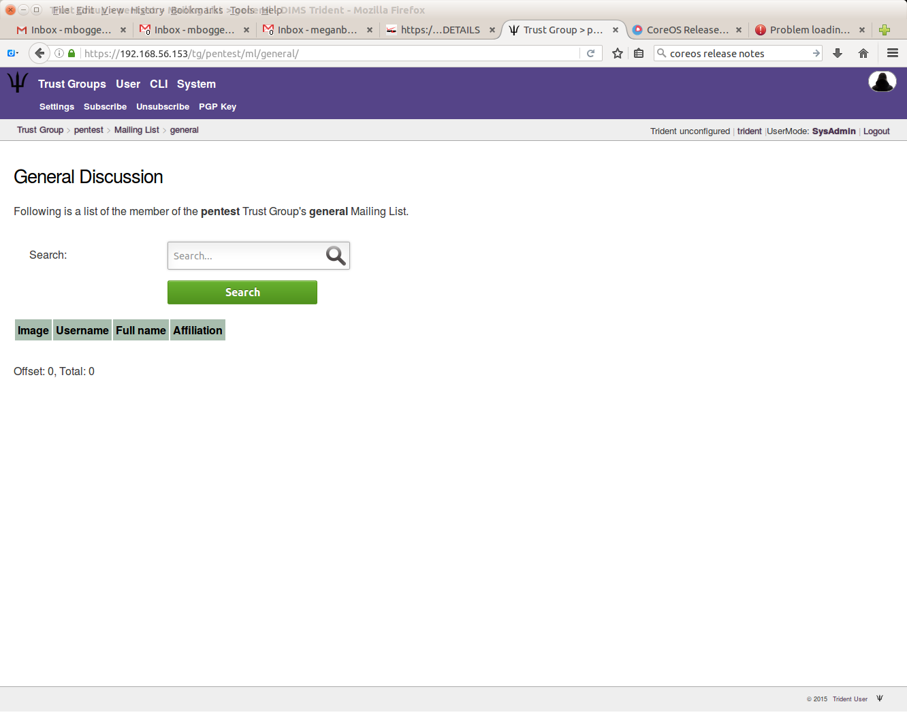
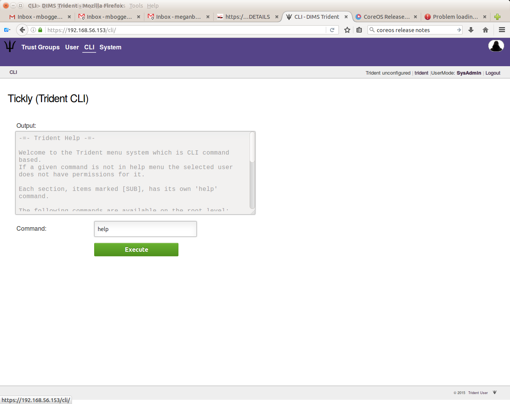

.. _tridentguide:

Trident
=======

This chapter introduces `Trident`_, a "Trusted Information Exchange
Toolkit" that facilitates the formation of trust groups, 
communication between members of trust groups, among other things.
This chapter will walk through the installation and configuration 
of Trident and its prerequisites. How to use Trident and its various 
features will be covered in a different section. 

.. TODO(mboggess)
.. todo::

     Add intersphinx link in the above paragraph to indicate
     where to find instructions on how to use Trident.
     :ref:`tbd:tbd`
..

.. _ansiblemanagedtrident:

Installing Trident with Ansible
-------------------------------

Prerequisites
^^^^^^^^^^^^^

The following items are necessary before installing Trident via
Ansible:

     * Access to and knowledge of how to use Ansible roles
       foundational to provisioning DIMS systems. More information
       about these roles can be found at tbd:tbd.

     * Host(s) provisioned by Ansible roles foundational to 
       DIMS systems. If using multiple hosts for a Trident
       instance, they must all be provisioned with these roles.

     * Access to and knowledge of how to use Ansible roles
       specific to standing up a working Trident instance. More 
       information about these roles can be found below, and 
       information about how to provision a host with them can
       be found at tbd:tbd.
       
     * Latest Trident package OR

     * Access to the github.com Trident repo

.. TODO(mboggess)
.. todo::

     Add intersphinx link in the above points to indicate
     where to find instructions on foundational DIMS Ansible
     roles and how to provision hosts with those roles.
     :ref:`tbd:tbd`
..

Trident Artifact Build Process
^^^^^^^^^^^^^^^^^^^^^^^^^^^^^^

.. note::

     You must have access to the Trident github repo
     in order to build Debian packages. You must be
     able to clone the repo.

..

The following section outlines the steps needed to
obtain/update the Trident source code and build a Debian
package from it so that artifact is available for
use by the Ansible role.

#. Prerequisite environment, per Trident documentation
   on their ``DEV-1.3`` branch:

     * Debian Jessie

#. Prerequisite packages, per Trident documentation
   on their ``DEV-1.3`` branch:

     * build-essential

     * git

     * pbuilder

#. Additional packages required, not listed in Trident's
   documentation:

     * dh-systemd

     * golang-go

#. Also, not listed in Trident's "build" requirements list,
   you must have Go installed. In Trident's "runtime"
   requirements list, it says version 1.5.1+, so I have
   downloaded and installed version 1.5.1.

   .. code-block:: none

        $ cd /usr/local
        $ wget https://storage.googleapis.com/golang/go1.5.1.linux-amd64.tar.gz
        $ sudo tar -xzf go1.5.5.linux-amd64.tar.gz
        $ export PATH=$PATH:/usr/local/go/bin

   ..

#. If you have a copy of the Trident source code, determine
   which version it is by running

   .. code-block:: none

        $ /usr/sbin/tridentd --version

   ..

#. Compare this with the latest version of Trident source
   code on GitHub. This is a little tricky because there
   is a mismatch of version numbers between the ``debian/changelog``
   file in the repo and the tags and branch names.

   As of 13 Jul 2016, the official latest version is 1.2.0.

   Go to the `Trident repo` on the master branch and go to
   the ``debian/changelog`` file. Here you will see the
   latest version.

#. Update or retrieve source code from GitHub. This may be
   a ``git clone`` or a ``git pull`` depending on how you
   are utilizing the Trident source (whether you need it
   once or if you are forking the repo).

#. In root directory of Trident git source, build the package:

   .. code-block:: none

       $ dpkg-buildpackage -b -uc -us

   ..

   This will build the binaries one level up from the trident root dir.

   .. note::

       The ``dpkg-buildpackage`` command will prompt you for
       your github username and password.

   ..

   .. note::

       The ``dpkg-buildpackage`` command runs a script called 
       ``doc/deps.sh`` which has a plethora for "cannot find
       package X" errors. This is a known issue, see
       https://github.com/bapril/trident/issues/371. It still
       seems to build a usable artifact...

   ..

#. Place debian package wherever your Ansible role retrieves
   the package from for installation.

Provisioning Process
^^^^^^^^^^^^^^^^^^^^

The following section outlines the steps needed to
provision a host to stand up a working Trident instance.

#. Ensure all variables for your deployment are set to
   the correct values. In particular, ensure any 
   Trident-Postgres-Nginx-Postfix networking
   variables are set correctly.

#. Apply the ``postgres`` Ansible role.

#. Apply the ``nginx`` Ansible role.

#. Apply the ``postfix`` Ansible role.

#. Apply the ``trident`` Ansible role.

Once all the roles have been applied, on the nginx host,
you should be able to browse to the proxy address and see
the Trident homepage. Instructions about how to actually
use Trident and set up trust groups, etc. can be found
at tbd:tbd.

.. TODO(mboggess)
.. todo::

     Add intersphinx link in the above points to indicate
     where to find instructions on how to use Trident.
     :ref:`tbd:tbd`
..

.. _tridentprerequisites:

Trident Prerequisites
---------------------

The following are prerequisites that must be installed and configured
before installing and configuring Trident:

* PostgreSQL 9.1+ database
* Postfix
* Nginx

.. _tridentpostgres:

PostgreSQL Database
^^^^^^^^^^^^^^^^^^^

The `Trident documentation`_ gives instructions on how to set up both a local
postgres server and Trident database, as well as a remote server and database. In this
section, we will cover and expand the instructions for installing and configuring
a remote postgres server and Trident database. See Trident's documentation page
for a local installation and configuration.

For remote postgres servers, the `Trident documentation`_ recommends temporarily
installing Trident on the remote target on which the postgres server will reside,
use Trident's ``tsetup`` command to create and setup the Trident database, then
remove the Trident package.

.. note::

    The "In a nutshell" steps in the "Remote Database" section of the `Trident documentation`_
    seem to conflict with each other and the steps outlined in the "Local Database" section,
    which the location should really be the only thing that differentiates the two, I believe.

    The following is my best interpretation, though it is just that, my interpretation. Notes
    and todo blocks follow at steps where I'm interpreting.
..

Essentially, the following steps would need to occur on the remote target:

#. Install PostgreSQL 9.1+

#. Create the *system* ``trident`` user

   .. TODO(mboggess)
   .. todo::

       In the `Trident documentation`_ on the "Remote Database", it says that the ``trident``
       user needs to be created on the remote server. Is this different from the PostgreSQL
       ``trident`` user? (A system user vs. an application's user?) Thus, a *system* ``trident``
       user needs to be created to run the Trident ``tsetup`` command, which then creates
       the PostgreSQL ``trident`` user.

       I'm writing these docs under the assumption that there needs to be a *system* ``trident``
       user to run the ``tsetup`` command, which will then create a *PostgreSQL* ``trident``
       user.

   ..

#. Temporarily install the Trident package(s).

    .. TODO(mboggess)
    .. todo::

       Currently, the Trident dockerfile ($GIT/dims-dockerfiles/dockerfiles/trident/Dockerfile)
       retrieves the debian packages from ``source.prisem.washington.edu`` and then uses
       ``dpkg`` to install them.

       However, in the `Trident documentation`_ section "Quick and Dirty", a command
       ``dpkg -i trident-VERSION.deb`` is given, without any indication anywhere as to what
       ``VERSION`` is.

       Will this be available or do we need to keep populating the package on ``source``?
       According to an email from Linda Parsons (see email in :ref:`emailsotherdocs`), there's
       a Docker container she built specifically for updating the Trident package on ``source``.

    ..

    .. note::

        Here is a confusing bit from the "nutshell" steps in the "Remote Database"
        section of the `Trident documentation`_. The first two steps are to "Create
        the ``trident`` user" and "Create the ``trident`` database``, and the last
        step is "Run ``tsetup`` from the remote server as normal". However, ``tsetup``
        *does* those two things (user and database creation).

        The third step says "Provide permissions for *the user* to access the database".
        I'm not sure *which* user this means--the PostgreSQL ``trident`` user, I'm
        assuming. I'm also assuming that since ``tsetup`` creates a ``trident`` user for
        PostgreSQL, it will also give it the appropriate permissions. (I'm assuming
        this because the "Local Database" section said nothing about giving anyone 
        appropriate permissions.)

        Perhaps I'm confused, and this step means give the *system* ``trident`` user
        appropriate permissions, but...I don't think the system user would be accessing
        the database.

        Either way, for now, until this is clarified, I'm "skipping" this step because
        it seems to be taken care of by another "step".

    ..

#. Properly configure the Trident daemon at ``/etc/trident/trident.conf``

   The following is a template of ``trident.conf``:
   
   .. literalinclude:: trident-trident.conf.j2

#. Properly configure the postgres ``pg_hba.conf`` file (location variable)

   The following is a template of ``pg_hba.conf``:
   
   .. literalinclude:: pg_hba.conf.j2

#. Ensure reachability of the database port defined in ``/etc/trident/trident.conf``

#. Create the Trident database using the following command: ``su - postgres -c "/usr/sbin/tsetup setup_db``

#. Remove the Trident packages

   .. TODO(mboggess)
   .. todo::

       If the system ``trident`` user had to be added to run
       the ``tsetup`` commands, should that user now be deleted?

   ..

.. _tridentnginx:

Nginx Webserver
^^^^^^^^^^^^^^^

#. Install Nginx

#. Properly configure ``/etc/nginx/conf.d/trident.conf``

   The following is a template of the nginx ``trident.conf``
   for a *production* system:
   
   .. literalinclude:: nginx-trident-production.conf.j2

   .. TODO(mboggess)
   .. todo::

       This still needs ssl certs, etc. 
   ..

   The following is a template of the nginx ``trident.conf``
   for a *development* system:
   
   .. literalinclude:: nginx-trident-development.conf.j2

   .. note::

       With this config, Nginx will only listen for the
       Trident daemon on an HTTP port (no HTTPS).

   ..

#. Properly configure Trident Daemon Upstream at ``/etc/trident/nginx/trident-upstream.inc``

   The following is a template of ``trident-upstream.inc``:
   
   .. literalinclude:: trident-upstream.inc.j2

#. Properly configure the Trident server at ``/etc/trident/nginx/trident-server.inc``

   The following is an example of ``trident-server.inc``:
   
   .. literalinclude:: trident-server.inc

   .. TODO(mboggess)
   .. todo::

      ``trident-server.inc`` may still need to be templated.

   ..

.. _tridentpostfix:

Postfix
^^^^^^^

#. Install Postfix

#. Know the answers to the following:

    * What type of mail configuration
    
    * The Fully Qualified Domain Name (FQDN) of your server

#. Properly configure Postfix's main config file at ``/etc/postfix/main.cf``

   The following is a template of ``main.cf``:
   
   .. literalinclude:: postfix-main.cf.j2

#. Properly configure ``/etc/aliases``

   The following is a template of ``aliases``:

   .. literalinclude:: aliases.j2

#. Might have to configure Postfix's master config file at ``/etc/postfix/master.cf``

   The following is an example of ``master.cf``:
   
   .. literalinclude:: postfix-master.cf

   .. TODO(mboggess)
   .. todo::

      ``master.cf`` may still need to be templated.

   ..

#. Might have to configure additional email addresses at ``/etc/postfix/virtual``

   The following is a template of ``virtual``:
   
   .. literalinclude:: postfix-virtual.j2

   .. TODO(mboggess)
   .. todo::

       I didn't template the emails/domains on the left side because 
       I wasn't really sure what they should be or if they were 
       related to any variables from other templates (particularly the
       domain--would that be the {{ tridentFQDN }} from the Trident
       daemon config? 

   ..

.. note::

    The `Trident documentation`_ gave the information used to configure
    the ``/etc/aliases`` file and the ``/etc/postfix/virtual`` file, 
    but then just said "Of course do configure the rest of Postfix
    properly." I don't really know what that means, so that's why
    I included the ``master.cf`` file, since that was included in the
    ``/etc/postfix`` dir. There are a couple other files there,
    ``/etc/postfix/dynamicmaps.cf`` and ``/etc/postfix/postfix-files``,
    along with a ``sasl/`` dir and a couple scripts. 

..

.. _tridentinstall:

Install Trident
---------------

Now we can install the Trident server and the Trident CLI.

#. Retrieve the Trident debian packages from ``source.prisem.washington.edu``

   .. code-block:: none

       $ wget http://source.prisem.washington.edu:8442/trident-server_1.0.3_amd64.deb
       $ wget http://source.prisem.washington.edu:8442/trident-cli_1.0.3_amd64.deb
       
   ..

   .. note::

       The version may change...the above commands need to be kept in sync.

   ..

#. Properly configure the Trident daemon at ``/etc/trident/trident.conf``

   This template can be seen in the :ref:`tridentpostgres` section.

#. Properly configure Trident daemon defaults at ``/etc/default/trident``

   The following is an example of ``/etc/default/trident``:
   
   .. literalinclude:: trident-default

   .. TODO(mboggess)
   .. todo::

      ``trident-default`` may still need to be templated.

   ..

.. _runningtrident:

Running Trident
---------------

There are several ways of running the Trident daemon, but we have divided
them into a "secure, non-debug" way and a "non-secure, debug" way.

* Insecure, debug:

    .. code-block:: none

        DAEMON_USER=trident /usr/sbin/tridentd \
           -insecurecookies \
           -disabletwofactor \
           -debug \
           -config /etc/trident/ \
           -daemonize \
           -syslog \
           -verbosedb

    ..

* Secure, non-debug:

    .. code-block:: none

        DAEMON_USER=trident /usr/sbin/tridentd \
           -config /etc/trident/ \
           -daemonize \

    ..

.. note::

    * The above code is from a start script used by the Dockerfile
      created by Linda Parsons ($GIT/dims-dockerfiles/dockerfiles/trident/conf/start.sh). 
      I just grabbed it to show how to run the daemon. We should 
      probably always have syslog enabled...

    * There's a note in that start script that says using the
      ``daemonize`` flag doesn't appear to be daemonizing the
      Trident daemon. Should keep that in mind.

    .. todo::

        * Probably all of these services should be controlled by supervisor 
          or something.

    ..

..

.. _configuringtridentviawebapp:

Configuring Trident via web app
-------------------------------

Once Trident is running and DNS is working properly, to get to the web
GUI, you will navigate to trident.$category.$deployment in your
web browser, given what development category and DIMS deployment you are
in.

This will open the following home page:

       Trident home page

..

To login, click the sign-in button, which will take you to the
following page where you can enter your login information:

       Trident login page

..

The next page that opens will be a more or less blank page
until you set up some trust groups:

       Trident initial login page

..

In the top right corner will be your profile image (though it
will just say "Profile Image" until you upload one), as well
as the Trident system name (unconfigured at the beginning),
your username, your "UserMode" or status, and the logout link.
The "UserMode" is either "Regular" or "Sysadmin". You must have
system administration access in order to anything besides edit
your own profile and look at trust group information of trust
groups you are in.

To switch to a "Sysadmin" UserMode, click the "Regular" UserMode
link in the top right corner. This will swap you to "Sysadmin"
status and the page will slightly change. This is shown below:

       Change to sysadmin

..

Changing to "sysadmin" allows you to add and configure trust groups,
to have acces to the Trident command line interface, tcli (or "tickly"), and
to view and monitor reports, logs, and settings for this particular
Trident system.

 
User configurations
~~~~~~~~~~~~~~~~~~~

This section walks through the configuration of a user who has
sysadmin privileges. There are a couple differences between what a
"regular" user can configure and what a "sysadmin" user can configure.
The "password reset" section is not available to users without sysadmin
privileges. Additionally, there are a couple profile items hidden from
regular users.

To begin, click the "User" tab at the top of the page. This will take you
to a table of contents page with links to various things you can edit or
look at for your user. These are also itemized in the second row at the
top of the page.

       Options for editing a user

..

To edit the user's profile, click the "Profile" link, either in the
table of contents list or in the second row at the top of the page.
This will take you to a page where you can edit profile information
for the user.

       Profile options

..

To update the profile, make sure to scroll all the way through all the
options, and at the end of the page, there is the "Update Profile"
button. This will leave you at the Profile page, but if you scroll
all the way back down, you'll see a notice about how many fields were
update and how many were not modified.

       Profile update

..

You can change your user's username:

       Change user's username

..

You can change your user's password:

.. figure:: images/trident/user/TridentUserPassword.png
       :width: 85%
       :align: center

       Change user's password

..

You can set up two-factor authentication:

       Setup two-factor authentication

..

You must add and verify your email address to receive
emails from trust groups to which you belong. First,
"create" your email:

       Create user email

..

Once you submit your email address, you must get a
verification code. Click the "Verify" button on this page
to get the verification code sent to you via email:

       Verify user email

..

Once you receive the email with the code, put the code in
the "Verification Code" box on the following page:

       Submit verification code

..

If it is a valid verification code, your email's status
will change from "Unverified" to "Verified".

       Verified email status

..

You can also download your user's PGP keys:

       Download PGP keys

..

You can also view an audit log for your user:

       View user audit log

..

As a "sysadmin" user, you can do all of these things
for all users under your administration. A list of these
users can be found by clicking the "User" tab in the second
row at the top of the page, when in "Sysadmin" UserMode.

       View user list as sysadmin

..

Additionally, only a sysadmin can reset another user's password
or remove an email address.

       Reset a user's password as sysadmin

..

       Remove an email as sysadmin

..

Sysadmin configurations
~~~~~~~~~~~~~~~~~~~~~~~

Sysadmins can set up trust groups, view information about their system, and
use the Trident command line interface, tcli (or "tickly"), through the web
app. This section walks through these features.

Trust group configurations
^^^^^^^^^^^^^^^^^^^^^^^^^^

The initial login page will list your trust groups. If you don't have
any, or to add new ones, click the "Add Trust Group" link in the second
row at the top of the page.

       No trust groups, yet.

..

The following page will start the configuration of the trust group,
starting with a name for the trust group.

       Add a trust group

..

.. warning::

    If there isn't at least one verified email address,
    this will fail.

.. 

Once you have at least one trust group, clicking the "Trust Group" tab
at the top of the page will give you an index of the trust groups you
have access to. This list can be seen as a regular user or as a sysadmin
user, as can be seen by this page (shown from the regular user perspective):

       List of trust groups

..

As a sysadmin user, however, you can do much more than just view a list
of trust groups. For all trust groups under your administration, you
can manage users, set up mailing lists, view audit logs, set up and
use wiki and file storage, as well as set other configurations and
download PGP keys.

In order to have access to the wiki and file storage, you must set that
up via the group settings:

       Some trust group settings

..

You must select the "Wiki Module" and "Files Module" if you want to
use those features:

       Some trust group settings

..

Trust group wiki:

.. figure:: images/trident/trustgroup/TridentTrustGroupWiki.png
       :width: 85%
       :align: center

       Empty trust group wiki

..

Trust group files:

       Empty trust group file storage

..

You can then click the tabs near the top of the page or the green
buttons in the middle of the page to "Add" a file or directory or
to list the files and directories.

Download PGP keys:

       Download trust group PGP keys

..

See list of trust group members:

       List of trust group members

..

To nominate a user, you must search for them via their email address:

       Search by email to nominate user

..

To add mailing lists, choose a trust group, then click the "Mailing List"
tab in the second row at the top of the page. There are some default
mailing lists when you add a trust group:

       Default trust group mailing lists

..

Click the "New Mailing List" in the second row at the top of the page.
On the next page, give your mailing list a name:

       Add trust group mailing list

..

You can then see the newly added mailing list:

       Default and added mailing list index

..

Once the mailing list is created, you can update its settings,
subscribe or unsubscribe users, and view the PGP key.

To update a mailing list's settings, choose a mailing list, then
click the "Settings" tab in the second row at the top of the page.

       Update mailing list settings

..

If no users have been subscribed to a mailing list, you'll see the
following page:

       No members on mailing list

..

To add a user to a mailing list, choose a trust group and a mailing list,
then click the "Subscribe" tab in the second row at the top of the page.
Type in the username of the user you'd like to subscribe to the list.

       Add member to mailing list

..

If the user already exists on a mailing list, you'll see the following:

       Already member on mailing list

..

To see the users on a mailing list, choose a trust group and a mailing
list, and you'll see a list of users and basic information about them:

       List of users on mailing list

..

As a user, you can see which mailing lists you are subscribed to by
particular trust groups:

.. figure:: images/trident/trustgroup/TridentTGMLGeneralSubscribed.png
       :width: 85%
       :align: center

       Mailing list subscription status

..

To unsubscribe a user, choose a trust group and a mailing list, then click
the "Unsubscribe" tab in the second row at the top of the page. Then give
the username you'd like to unsubscribe from the given mailing list, and
click "Unsubscribe".

       Unsubscribe a user

..

System information
^^^^^^^^^^^^^^^^^^

To view the Trident System information, you must be a sysadmin. Click the
"System" tab in the top row at the top of the page.

       Trident system information options

..

To view the audit log, click the "Audit Log" link in the index, or
click the "Audit Log" tab in the second row at the top of the page.

       Trident system audit log

..

To view the report, click the "Report" link in the index, or
click the "Report" tab in the second row at the top of the page.

       Trident system report

..

To change the system settings, click the "Settings" link in the index,
or click the "Settings" tab in the second row at the top of the page.

       Trident system settings

..

Don't forget to click the "Update Settings" button at the bottom
of the page for the changes to take affect.

       Update Trident system settings

..

Basic tcli use
^^^^^^^^^^^^^^

To use tcli via the web app, you must be a sysadmin user. Click
the "CLI" tab at the top of the page.

To get started, you can type the "help" command into the box,
and you'll get useful information on how to run tcli:

       Get tcli help

..

Anything you can run on the command line using tcli, you can
run via the web app.

.. _emailsotherdocs:

Emails and other non-official documentation
-------------------------------------------

* Email from Linda in response to Megan asking for any additional documentation.

.. literalinclude:: tridentemailsandanyotherdocumentation.txt

* There is an Ansible role called ``trident-docker-deploy`` located in
  ``$GIT/ansible-playbooks/roles``. This roles creates a volume container to
  be paired with a DIMS postgres container (if it doesn't already exist), and
  a DIMS postgres container and DIMS Trident container.

  The Dockerfiles and related files and scripts for these containers can
  be viewed at:

      * Postgres: ``$GIT/dims-dockerfiles/dockerfiles/postgres-trident``

      * Trident:  ``$GIT/dims-dockerfiles/dockerfiles/trident``

* Additionally, Linda created a couple "helper" containers. One container
  updates ``source.prisem.washington.edu`` and another builds off the 
  "fresh-install" DIMS postgres container to install a copy of the DIMS
  OPS-Trust database. 

  These can be viewed at:

      * Build: ``$GIT/dims-dockerfiles/dockerfiles/trident-build``

      * Original Database: ``$GIT/dims-dockerfiles/dockerfiles/postgres-trident-clone``

.. _Trident: https://trident.li
.. _Trident documentation: https://trident.li/doc/
.. _Trident repo: https://github.com/bapril/trident
